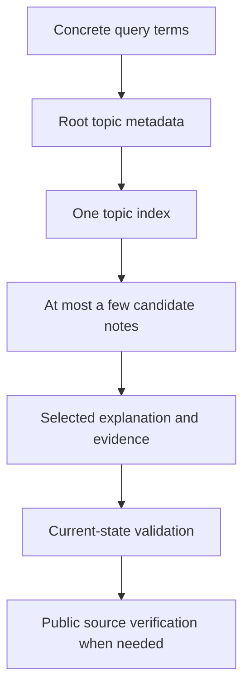

# Bounded Markdown knowledge retrieval for coding agents

## TL;DR

Keep discovery metadata small and load detailed instructions or notes only after
a concrete match. Agent Skills uses this progressive-disclosure shape: metadata
is available for discovery, the skill body loads when selected, and supporting
files load only when needed. [S1]

A repository wiki can apply the same idea with a root topic index, narrow topic
indexes, and atomic notes. `llms.txt` offers a similar concise-index convention,
but it is a community proposal and does not guarantee that a coding agent will
discover, rank, or follow it. [S2]

## When To Read

- Use when an Agent should reuse prior technical knowledge before external
  research without injecting the entire note collection.
- Use when note growth makes one flat index too large or ambiguous.
- Do not use the wiki as proof of current artifact, configuration, deployment, or
  runtime state.
- Do not assume keyword retrieval provides semantic ranking, typo correction, or
  freshness detection.

## Knowledge

### Retrieval Hierarchy



```text
bounded query terms
→ root topic metadata
→ one topic index
→ at most a few candidate notes
→ current-state validation
→ public source verification when needed
```

The root index answers only “which topic should I search?” A topic index exposes
stable note IDs, status, keywords, aliases, a one-sentence summary, and a link.
The note owns explanation and evidence. Public sources own external facts.

This hierarchy keeps indexes human-readable while preventing note bodies and raw
source material from becoming permanent prompt input. Skill descriptions and
note summaries should contain concrete retrieval terms; detailed procedures stay
in referenced files. [S1]

### Metadata And Stable Identity

Flat frontmatter gives checkers and humans a predictable contract. Metadata such
as title, description/summary, date, and topic is commonly used by documentation
systems for validation and discovery. [S3]

A stable note ID is separate from the title. A title can improve while links,
index entries, evaluations, and supersession relationships continue to refer to
the same ID.

### Source Durability

For public GitHub source files, use a commit-SHA permalink rather than a branch
URL; GitHub documents that the permalink points to that exact file revision. [S4]
For mutable documentation, record the access date and the exact claim supported.

### Retrieval Evaluation

Retrieval quality needs task-specific cases rather than an intuition that the
index “looks searchable.” OpenAI’s evaluation guidance recommends tests based on
representative inputs, automated scoring where possible, and human calibration.
[S5]

A deterministic keyword-wiki fixture can assert:

- the expected note is returned for canonical and alias queries;
- a close distractor does not outrank it;
- `open` and `superseded` status remains visible;
- lookup output contains metadata, not full note text;
- no match returns an explicit empty result instead of scanning all notes.

### Boundaries

- A keyword hit indicates possible relevance, not applicability.
- A `verified` note records a verified represented case or public fact; it does
  not verify the current target.
- An `open` incident can preserve evidence and wrong turns without inventing a
  root cause or final fix.
- Index generation is unnecessary when a checker can enforce a small curated
  index. Human curation preserves useful aliases and retrieval boundaries.

### Common Mistakes

- **Loading every note:** raises context cost and lets unrelated precedents bias
  the answer.
- **Using only titles:** misses error phrases, operational aliases, and reader
  vocabulary.
- **Treating `llms.txt` as a standard client API:** its processing behavior is
  not universally implemented or enforced. [S2]
- **Citing `main` for source behavior:** the linked code can change after the
  note was verified. [S4]
- **Measuring only recall:** returning every vaguely related note can find the
  answer while wasting context; top-result precision and unnecessary loads also
  matter. [S5]

### Minimal Example

```text
Query: "pod restart connection refused"
Index result: incident-example, score=18, matched=liveness|restart-loop
Agent reads: one topic index + incident-example.md
Agent still checks: current Pod events, probe timing, image, and runtime state
```

## Sources

| ID | Source | Accessed | Supports |
| --- | --- | --- | --- |
| S1 | [Agent Skills Specification](https://agentskills.io/specification) | 2026-09-11 | Progressive disclosure from metadata to instructions and supporting resources |
| S2 | [llms.txt proposal](https://llmstxt.org/) | 2026-09-11 | Concise Markdown overview and linked-detail convention |
| S3 | [Microsoft Learn metadata guidance](https://learn.microsoft.com/en-us/contribute/content/metadata) | 2026-09-11 | Documentation metadata used for authoring and discovery contracts |
| S4 | [GitHub documentation: Getting permanent links to files](https://docs.github.com/en/repositories/working-with-files/using-files/getting-permanent-links-to-files) | 2026-09-11 | Commit-based links preserve an exact public file revision |
| S5 | [OpenAI evaluation best practices](https://platform.openai.com/docs/guides/evaluation-best-practices) | 2026-09-11 | Task-specific evaluations, representative cases, automated scoring, and human calibration |

## Related Notes

- [A liveness restart does not establish the startup root cause](../incidents/synthetic-startup-restart-causality.md)
