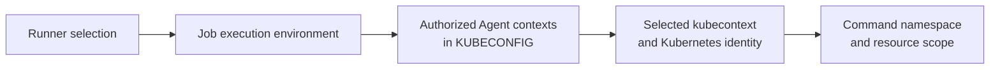

# Separate CI execution from Kubernetes target selection

## TL;DR

A GitLab runner decides where and how a CI job executes. A GitLab Agent for
Kubernetes connection decides which Kubernetes contexts an authorized job can
use. GitLab states that a runner does not need to run in the cluster where the
agent is installed. [S1]

Runner selection, agent authorization, kubecontext selection, Kubernetes API
authorization, and namespace selection are independent checks. Treating one as
proof of another causes wrong-cluster deployments and misleading diagnostics.

## When To Read

- Use when a CI job has no expected context or reaches the wrong cluster.
- Use when runner tags are being used as if they were deployment authorization.
- Use when several agents or namespaces are available to one pipeline.
- Do not print generated kubeconfig content or tokens while debugging.

## Knowledge

### Five Boundaries



The Kubernetes executor creates a Pod for each CI job in the runner's configured
cluster. That execution cluster can differ from the target cluster selected by a
GitLab Agent context. [S1] [S2]

GitLab adds contexts for authorized agent connections to the CI job kubeconfig.
The job must select the intended context before it runs Kubernetes commands. Agent
project or group authorization controls which jobs receive those contexts. [S1]

### Explicit Target Selection

A deployment job should resolve and check these values before mutation:

```text
expected environment
expected agent context
expected Kubernetes API server identity
expected namespace
expected workload or application selector
```

Use exact context names supplied by the trusted configuration contract. Avoid
substring selection such as “first context containing dev,” because several
projects or agents can produce similar names.

Set namespace explicitly with a command option or a reviewed context default.
Namespace omission can query or change the default namespace while the context
still points to the correct cluster.

### Authorization Layers

Agent authorization lets a project receive an agent context. Kubernetes still
evaluates the credentials and impersonation configured for that connection.
Runner tags only route jobs to runners; they do not grant Kubernetes RBAC.

Keep the roles separate:

- runner administrator controls job execution capacity and executor settings;
- agent configuration controls which GitLab projects receive a connection;
- Kubernetes authorization controls allowed API operations;
- pipeline logic selects the target context and namespace.

### Boundaries

- A runner inside a cluster is not automatically authorized to that cluster
  through the GitLab Agent. [S1]
- A valid context proves connectivity metadata exists, not that RBAC permits the
  requested operation.
- A successful API query against one namespace does not prove access to another.
- The Kubernetes executor's service account controls the job Pod in its execution
  cluster; the selected Agent context controls API calls to the target cluster.
  [S2]
- Context availability can follow authorization changes after propagation delay.
  [S1]

### Common Mistakes

- **Using runner tags as cluster selection:** tags choose execution capacity, not
  the Agent context.
- **Assuming runner and target clusters are identical:** GitLab explicitly allows
  them to differ. [S1]
- **Selecting the first kubecontext:** context order is not a deployment contract.
- **Leaving namespace implicit:** correct-cluster queries can still inspect the
  wrong resources.
- **Dumping kubeconfig for diagnosis:** generated credentials and connection data
  can be sensitive.

### Minimal Preflight

```text
1. Verify the expected runner class without inferring target authorization.
2. Test that the exact expected context name exists.
3. Select that context explicitly.
4. Query non-secret cluster identity and namespace fields.
5. Check the exact required API permission.
6. Run the scoped deployment or status command.
```

Stop if more than one target matches, expected identity differs, or the required
context or permission is absent.

## Sources

| ID | Source | Accessed | Supports |
| --- | --- | --- | --- |
| S1 | [GitLab CI/CD with a Kubernetes cluster](https://docs.gitlab.com/user/clusters/agent/ci_cd_workflow/) | 2026-09-13 | Agent authorization, per-agent contexts, KUBECONFIG delivery, context selection, and runner independence from the target cluster |
| S2 | [GitLab Runner Kubernetes executor](https://docs.gitlab.com/runner/executors/kubernetes/) | 2026-09-13 | Job execution as Pods and executor-side namespace and service-account configuration |

## Related Notes

- [Bound CI concurrency and retry at their owning layers](bounded-ci-concurrency-and-retry.md)
- [Gate GitOps delivery on explicit reconciliation evidence](gitops-reconciliation-health-and-pipeline-gates.md)
