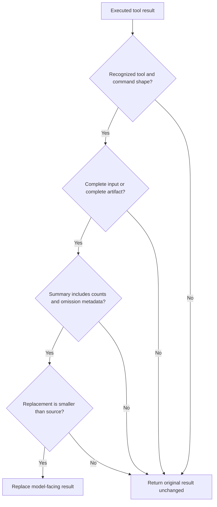

# Deterministic context projection for tool results

## TL;DR

Pi permits a `tool_result` extension handler to patch the returned content,
details, or error state after a tool runs. [S1] [S2] This repository uses that
hook for deterministic projections: recognize a narrow command class, validate
complete input, produce a structured summary, and keep it only when it is
smaller than the original result.

The capability is context reduction without requiring the model to interpret
raw high-volume output first. It is not evidence deletion: the projection must
say whether content is complete and where a validated complete source remains
available. The repository-specific gates below come from current local source
and tests; an immutable public permalink is still pending.

## When To Read

- Use when a tool emits large, structured output that has a stable public-safe
  projection.
- Use when a child result needs a byte and line budget before returning to its
  parent.
- Do not use a projection as the only record of a failed command or incomplete
  source.

## Knowledge

### Mechanism



A Pi result handler receives the executed tool name, input, content, error flag,
and tool-specific details; a returned patch can replace only those result fields.
[S2] The repository design applies four gates before replacing model-facing text:

1. route only recognized tools and command shapes;
2. reject truncated or malformed input unless a validated complete artifact is
   available;
3. preserve structured counts, omissions, and `content_complete=false` when a
   budget prunes content;
4. retain a replacement only when it is smaller than the source.

A processor error, unsupported command, mismatched result kind, or an expansion
is a fail-open outcome: return the original result unchanged. This choice is
repository behavior, not a Pi product guarantee.

### Trust Boundary

Pi extensions run arbitrary code with the host's full system permissions. [S1]
A projection therefore does not make an untrusted command safe. It only controls
what enters the next model turn after the command has already run.

Treat the original tool result, a temporary complete-output path, and projection
metadata as separate artifacts. A summary can help triage; it cannot prove that
omitted records were harmless.

### Common Mistakes

- **Summarizing a truncated result as complete:** downstream reasoning cannot
  distinguish absence from omission.
- **Replacing every shell result:** prose, errors, and unknown formats lack a
  stable projection contract.
- **Discarding source location:** a reader cannot inspect a surprising summary.
- **Using a model-generated synopsis as an enforcement layer:** it can be useful
  guidance but is not deterministic evidence preservation.

### Minimal Example

```text
complete test output (18 KiB)
  -> recognized test-result projection
  -> 3 KiB summary: failures, test identifiers, content_complete=true
  -> validated complete-output path remains available when recovery is needed

truncated unknown output
  -> no projection
  -> original tool result remains visible
```

## Sources

| ID | Source | Accessed | Supports |
| --- | --- | --- | --- |
| S1 | [Pi extensions documentation](https://github.com/earendil-works/pi/blob/38f18be44727e669eb0a6e2eb8edb51b0232d83c/packages/coding-agent/docs/extensions.md) | 2026-09-12 | `tool_result` runs after tool execution, may modify results, and extensions have full system permissions. |
| S2 | [Pi extension types](https://github.com/earendil-works/pi/blob/38f18be44727e669eb0a6e2eb8edb51b0232d83c/packages/coding-agent/src/core/extensions/types.ts) | 2026-09-12 | The tool-result event fields and optional `content`, `details`, and `isError` patch fields. |

## Related Notes

- [Intent routing and adapter verification](intent-routing-and-adapter-verification.md)
- [Evidence layers and causal restraint](evidence-layers-and-causal-restraint.md)
