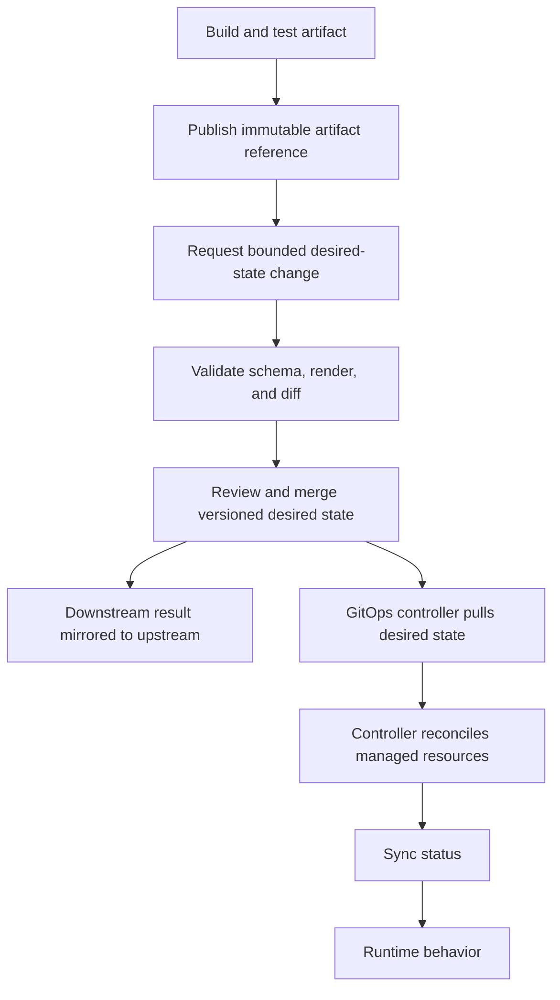

# Replacing direct deployment with a GitOps handoff

## TL;DR

Build and test an artifact once, identify it immutably, record that reference in
version-controlled desired state, and let a GitOps controller reconcile the
runtime system. OpenGitOps defines desired state as declarative, versioned and
immutable, pulled automatically, and continuously reconciled. [S1]

Argo CD automated sync lets a CI/CD pipeline commit and push manifest changes
instead of using direct deployment access to the Argo CD API server. [S2] A
GitLab multi-project downstream pipeline can carry this handoff to a separate
desired-state repository, and `strategy: mirror` can make the trigger job reflect
the downstream pipeline status. [S3]

## When To Read

- Use when CI runs `helm upgrade`, `kubectl apply`, or an equivalent deployment
  command for resources that should be managed by a GitOps controller.
- Use when an application repository must pass a built artifact reference to a
  separate desired-state repository.
- Do not use this pattern to bypass review, protected-branch policy, deployment
  authorization, or environment promotion controls.
- Do not treat a successful downstream pipeline as proof of reconciliation or
  runtime health.

## Knowledge

### Ownership Model



A GitOps handoff separates artifact production from runtime reconciliation:

```text
application pipeline
  → build and test
  → publish immutable artifact
  → request a bounded desired-state change

desired-state workflow
  → validate schema, render, and diff
  → apply repository review and merge policy

GitOps controller
  → pull desired state
  → reconcile managed resources
  → report sync and health separately
```

Assign one reconciliation owner to each managed resource. If direct deployment
remains active after a GitOps controller starts managing the same resource, the
direct job can create state that differs from Git. The controller can detect and
replace that difference during a later sync, depending on its sync policy. [S2]

### Immutable Artifact Handoff

The desired-state change should identify the exact artifact that passed the
application pipeline. Kubernetes documents that an image digest identifies a
specific immutable image, while a tag can be moved to another image. [S4]

A digest is the clearest container-image handoff:

```text
registry.example.test/example-service@sha256:1111111111111111111111111111111111111111111111111111111111111111
```

A release identifier can serve the same purpose only when the registry and
promotion process guarantee that it cannot be reassigned. Record that guarantee
instead of assuming every tag is immutable.

### Downstream Pipeline Contract

GitLab supports a multi-project pipeline triggered from another project. The
triggering user must have permission to start the downstream pipeline. With
`strategy: mirror`, the trigger job has the same status as the downstream
pipeline. [S3]

```yaml
update-desired-state:
  stage: release
  variables:
    IMAGE_REF: registry.example.test/example-service@sha256:1111111111111111111111111111111111111111111111111111111111111111
  trigger:
    project: example-group/deployment-config
    branch: main
    strategy: mirror
```

The downstream pipeline still needs its own bounded contract. It should accept
an artifact reference and an allowed target, change only the intended desired
state, and run repository validation. A downstream job that executes a direct
cluster deployment is pipeline chaining, not a GitOps handoff.

### Evidence Layers

Keep these results separate:

1. The application pipeline proves that it built and tested one artifact.
2. The desired-state diff proves what repository configuration changed.
3. The downstream pipeline proves that its configured jobs completed.
4. The GitOps controller proves reconciliation status.
5. Runtime checks prove workload behavior.

`strategy: mirror` connects the upstream result to the downstream pipeline
result. It does not prove that a later GitOps reconciliation succeeded. [S3]

### Boundaries

- Automated sync is a controller setting, not permission to merge every proposed
  desired-state change. Repository policy still decides what can merge.
- A Git commit records desired state; it does not prove that the controller saw,
  applied, or retained that state.
- A mutable image tag weakens traceability even when every manifest change is
  versioned. [S4]
- Promotion should move one tested artifact reference through environments. A
  rebuild creates a new artifact and needs new provenance.
- Rollback should restore a prior known desired-state revision and its immutable
  artifact reference. Runtime rollback behavior still depends on the managed
  workload and controller policy.

### Common Mistakes

- **Leaving the direct deployment job enabled:** two writers can act on the same
  resource, so Git no longer explains every live change.
- **Passing only a mutable tag:** the desired-state history can remain unchanged
  while the registry points that tag at different content. [S4]
- **Treating trigger success as deployment success:** without status mirroring,
  the upstream trigger can finish before the downstream result is known; with
  mirroring, reconciliation and runtime evidence are still separate. [S3]
- **Granting CI broad cluster access after migration:** automated sync exists in
  part so CI does not need direct Argo CD deployment access. [S2]
- **Updating several targets through one unrestricted input:** a handoff should
  validate the allowed repository path and target before changing desired state.
- **Removing the old path before proving the new handoff:** verify downstream
  validation and controller observation before deleting recovery options.

### Minimal Migration Sequence

1. Publish an immutable artifact from the existing application pipeline.
2. Add a bounded downstream desired-state update without disabling the current
   deployment path.
3. Validate the exact repository diff and downstream pipeline result.
4. Confirm that the GitOps controller observes the desired revision in a safe
   target.
5. Disable the direct deployment writer for that target.
6. Confirm reconciliation and workload behavior through their own evidence
   layers.
7. Remove obsolete credentials and pipeline logic after the recovery window.

Stop if both paths can modify the same managed resource, the artifact reference
is mutable, the desired-state diff is not bounded, or controller evidence is
unavailable.

## Sources

| ID | Source | Accessed | Supports |
| --- | --- | --- | --- |
| S1 | [OpenGitOps principles](https://opengitops.dev/) | 2026-09-11 | Declarative, versioned and immutable, automatically pulled, and continuously reconciled desired state |
| S2 | [Argo CD automated sync policy](https://argo-cd.readthedocs.io/en/stable/user-guide/auto_sync/) | 2026-09-11 | Automated sync behavior and a commit-based CI handoff without direct Argo CD API deployment access |
| S3 | [GitLab downstream pipelines](https://docs.gitlab.com/ci/pipelines/downstream_pipelines/) | 2026-09-11 | Multi-project pipeline triggers, permission boundary, and downstream status mirroring |
| S4 | [Kubernetes images](https://kubernetes.io/docs/concepts/containers/images/) | 2026-09-11 | Immutable image digests and mutable image tags |

## Related Notes

- None.
