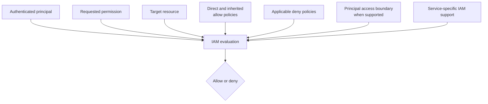

# Evaluate Google Cloud IAM access by policy layer

## TL;DR

An IAM role binding grants a principal the permissions in that role on a resource
and, where hierarchy applies, its descendants. Effective access can also include
inherited allow policies and can be limited by applicable deny policies or
principal access boundary policies. Policy-type support varies by service. [S1]
[S2] [S3]

Authentication establishes who is calling. Impersonation lets one principal obtain
short-lived credentials for a service account when authorized. The target API
still evaluates the impersonated service account's permissions on the resource.
[S4]

## When To Read

- Use when a principal has an expected role but a request is denied.
- Use when access appears broader than the policy attached directly to a resource.
- Use when reviewing service-account impersonation or least privilege.
- Do not infer permissions from role names; inspect their current definitions.

## Knowledge

### Evaluation Inputs



An allow policy attaches to a resource and contains role bindings. Resource
hierarchy lets policies on an organization, folder, or project affect descendant
resources. A child policy adds to inherited grants; it does not subtract a parent
allow. [S1] [S2]

Deny policies can block specified permissions even when an allow policy grants
them, subject to documented exceptions and service support. Principal access
boundary policies limit the resources for which a principal can be made eligible.
These controls solve different problems and must be inspected separately. [S1]
[S3]

### Impersonation Chain

```text
caller
  -- permission to impersonate --> service account
  -- short-lived credentials --> target API
  -- target resource policy evaluates --> allowed or denied
```

Permission to impersonate does not grant the caller every permission directly.
It permits acting as the service account; effective target access then follows
that account's grants and applicable restrictions. [S4]

Record both identities in a review: the initiating principal and the effective
service account. Audit evidence may need both to explain the chain.

### Least-Privilege Review

1. Name the exact API permission and target resource.
2. Identify the effective principal used at the target API.
3. Find the narrowest predefined role that contains the permission.
4. Inspect direct and inherited allow bindings.
5. Check applicable deny and principal-boundary policies supported by the service.
6. If impersonation is used, review its grant separately from target-resource
   access.
7. Validate with a bounded request that exercises the required operation.

### Boundaries

- A role binding is not a credential. The principal still needs an authentication
  mechanism.
- Credential acquisition does not establish target authorization.
- Resource hierarchy inheritance applies to supported Google Cloud resources; a
  product can also have resource-specific access models.
- Deny and principal access boundary support is not universal. Check the target
  service documentation before relying on either. [S1] [S3]
- Basic Owner and Editor roles are broad and should not replace a permission-level
  requirement analysis.

### Common Mistakes

- **Checking only the resource's direct policy:** the grant may be inherited.
- **Assuming child policy can revoke a parent allow:** additive allow inheritance
  does not work that way. Use supported deny controls or change the parent grant.
- **Confusing service-account user and token creation permissions:** attaching or
  acting as a service account are distinct permissions and flows.
- **Granting a broad role to fix one denied permission:** this hides the actual
  permission boundary and widens unrelated access.
- **Ignoring the effective identity after impersonation:** target APIs authorize
  the impersonated account.

### Minimal Example

```text
Question: Can build-agent read object X?

1. build-agent authenticates as itself.
2. build-agent may impersonate deploy-reader.
3. deploy-reader needs the exact read permission on object X.
4. inherited allows and applicable denies are evaluated.
5. A bounded read verifies the resulting behavior.
```

## Sources

| ID | Source | Accessed | Supports |
| --- | --- | --- | --- |
| S1 | [Google Cloud IAM policy types](https://docs.cloud.google.com/iam/docs/policy-types) | 2026-09-13 | Allow, deny, and principal access boundary purposes and service-support boundaries |
| S2 | [Google Cloud resource hierarchy access control](https://docs.cloud.google.com/iam/docs/resource-hierarchy-access-control) | 2026-09-13 | Allow-policy inheritance through organizations, folders, projects, and descendants |
| S3 | [Google Cloud deny policies](https://docs.cloud.google.com/iam/docs/deny-overview) | 2026-09-13 | Deny precedence, policy attachment, exceptions, and supported permissions |
| S4 | [Google Cloud service account impersonation](https://docs.cloud.google.com/iam/docs/service-account-impersonation) | 2026-09-13 | Short-lived impersonated credentials and the caller-to-service-account authorization chain |

## Related Notes

- [Prefer Workload Identity Federation for GKE over service account keys](workload-identity-over-service-account-keys.md)
- [Limit CI to explicit GitOps status access](least-privilege-gitops-status-access.md)
