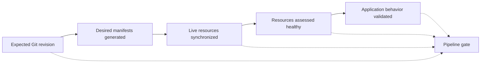

# Gate GitOps delivery on explicit reconciliation evidence

## TL;DR

Argo CD sync status compares live resources with desired manifests. Resource
health evaluates type-specific runtime status. `argocd app wait` can wait for sync,
health, operation completion, or selected resources, but the caller must request
the intended conditions. [S2] [S3]

A useful pipeline gate identifies the expected desired revision, waits for the
right application and target, requires explicit status conditions, and times out
with enough bounded evidence to diagnose failure. `Synced` alone is not an
application test; `Healthy` alone does not prove the gate observed the intended
revision.

## When To Read

- Use when CI updates desired state and waits for Argo CD.
- Use when a gate passes despite an unhealthy workload or waits on the wrong
  application, namespace, or cluster.
- Use when automated sync, self-heal, or prune changes delivery behavior.
- Do not use controller status as a substitute for user-facing validation.

## Knowledge

### Four Evidence Layers



Each arrow can fail independently. A pipeline that checks only one layer must say
what remains unverified.

Argo CD automated sync detects a difference between Git and live state and can
apply the desired manifests without CI calling the Argo CD API to sync. Automatic
pruning and self-healing are separate options; enabling automated sync does not
implicitly enable every correction behavior. [S1]

### Gate Contract

A bounded gate records:

- application identity and destination cluster or namespace;
- expected Git revision or immutable desired-state revision;
- required conditions such as sync, health, and completed operation;
- timeout and polling behavior;
- failure evidence that excludes credentials and secret values;
- the next evidence layer, such as a synthetic request or smoke test.

`argocd app wait` exposes separate flags for synchronized, healthy, degraded,
suspended, deleted, and operation states. [S3] Select conditions deliberately
instead of relying on a human interpretation of one combined status line.

### Failure Classification

```text
wrong revision observed  → handoff or selection failure
OutOfSync                → comparison or reconciliation gap
sync operation failed    → apply, hook, admission, or permission failure
Synced but not Healthy   → controller or workload convergence failure
Healthy but smoke fails  → application or dependency behavior failure
wait timeout             → classify using revision, operation, sync, and health evidence
```

A timeout is a symptom. Preserve the latest status, failed resource, operation
message, and expected revision so the pipeline does not replace the cause with a
generic timeout.

### Boundaries

- Argo CD health is derived from Kubernetes resource status and built-in or custom
  health rules. It does not know every application invariant. [S2]
- Pruning deletes resources absent from desired state and requires separate risk
  review. [S1]
- Self-heal lets automated sync correct live drift; it does not identify who
  caused that drift. [S1]
- A gate needs read access to status, not broad sync, update, delete, or log
  permissions.
- Application selection by an ambiguous name or broad label can observe the wrong
  target even when every command succeeds.

### Common Mistakes

- **Waiting for any successful sync:** an older revision can satisfy the check.
- **Treating Synced as Healthy:** comparison and health are different status
  dimensions.
- **Treating Healthy as end-to-end success:** resource health may not exercise a
  route, datastore, or queue.
- **Retrying until timeout without preserving state:** the final message hides the
  first failed operation.
- **Granting mutation rights to a status job:** observation does not require sync
  authority.

### Minimal Gate

```text
1. Resolve one application and one destination.
2. Confirm the controller reports the expected desired revision.
3. Wait for operation completion, Synced, and Healthy within a fixed timeout.
4. On failure, record bounded resource and operation status.
5. Run a behavior check for the changed user-visible path.
```

## Sources

| ID | Source | Accessed | Supports |
| --- | --- | --- | --- |
| S1 | [Argo CD automated sync policy](https://argo-cd.readthedocs.io/en/release-3.2/user-guide/auto_sync/) | 2026-09-13 | Automated sync, pruning, self-healing, and controller-driven reconciliation behavior |
| S2 | [Argo CD resource health](https://argo-cd.readthedocs.io/en/stable/operator-manual/health/) | 2026-09-13 | Health assessment as a separate resource-status mechanism |
| S3 | [Argo CD app wait command](https://argo-cd.readthedocs.io/en/stable/user-guide/commands/argocd_app_wait/) | 2026-09-13 | Explicit wait conditions, selectors, resource filters, and timeout support |

## Related Notes

- [Replacing direct deployment with a GitOps handoff](direct-deploy-to-gitops-handoff.md)
- [Limit CI to explicit GitOps status access](least-privilege-gitops-status-access.md)
