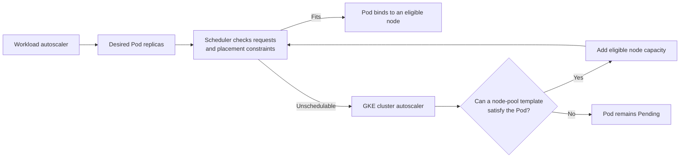

# Connect GKE scheduling constraints to autoscaling capacity

## TL;DR

The Kubernetes scheduler places a Pod only on a node that satisfies resource
requests and hard placement constraints. Node selectors and required affinity
filter eligible nodes; taints repel Pods without matching tolerations. [S3] [S4]
[S5]

GKE cluster autoscaling reacts to unschedulable Pods and adjusts node pools within
configured limits. It cannot make an impossible Pod schedulable. Spot VMs can be
reclaimed at any time and provide no availability guarantee, so workloads need
fault tolerance and alternate capacity where availability matters. [S1] [S2]

## When To Read

- Use when a Pod stays Pending despite enabled cluster autoscaling.
- Use when a node pool scales from zero or carries specialized hardware.
- Use when combining Spot and on-demand nodes.
- Do not treat HPA replica growth as proof that node capacity can grow.

## Knowledge

### Two Scaling Loops



HPA or another workload autoscaler changes replica demand. The scheduler checks
requests and constraints. Cluster autoscaling can then add nodes when a pending
Pod could fit a node pool template within configured limits. These loops have
separate owners and evidence.

### Schedulability Contract

The scheduler uses resource requests, not current average usage, to reserve
capacity. A missing request can weaken resource accounting; an oversized request
can keep a Pod Pending even when observed node usage looks low. [S5]

Hard constraints combine by intersection:

```text
requested CPU and memory fit
AND nodeSelector matches
AND required node affinity matches
AND taints are tolerated
AND other scheduler rules permit placement
```

A toleration allows consideration of a tainted node; it does not force placement
there. Node affinity can attract or require placement. [S3] [S4]

### Scale From Zero

For a zero-sized pool, autoscaling reasons from the node pool template. Labels,
taints, machine capacity, limits, zones, quotas, and stock availability must allow
a candidate node. [S2]

If no pool template satisfies the Pod, increasing a maximum does not fix the
constraint. Inspect scheduler events first, then compare the Pod requirements with
each eligible pool template.

### Spot Capacity

GKE Spot VMs are discounted but can be preempted at any time and do not have an
availability guarantee. Google recommends them for fault-tolerant workloads. [S1]

A resilient design can combine:

- multiple replicas across failure domains;
- disruption-tolerant queues or retry semantics;
- Pod disruption and termination handling;
- an on-demand pool for minimum serving capacity;
- placement rules that express preference instead of accidentally requiring only
  Spot capacity.

### Boundaries

- Cluster autoscaling does not override scheduler constraints or cloud quota.
- Resource limits control runtime ceilings; requests drive scheduling. [S5]
- A toleration is not an affinity rule. [S4]
- Spot reclamation is not governed by a workload's maintenance preference. [S1]
- Autoscaler decisions and timing vary by GKE mode, version, location policy, and
  node auto-provisioning configuration. [S2]

### Common Mistakes

- **Looking only at current node utilization:** scheduler events and requests own
  the placement decision.
- **Adding a toleration without a selector review:** the Pod may run on more node
  classes than intended.
- **Requiring a label absent from a zero-pool template:** no new node can satisfy
  the Pod.
- **Putting all replicas on Spot:** one capacity event can remove the whole serving
  set.
- **Changing HPA and node scaling together:** two changed loops make the limiting
  layer harder to identify.

### Minimal Diagnostic Order

```text
1. Read the Pod scheduling event.
2. Compare requests with allocatable capacity and pool templates.
3. Evaluate selectors, required affinity, taints, and tolerations.
4. Check autoscaling min/max and candidate pools.
5. Check quota, zone, and Spot availability constraints.
6. Validate placement and behavior after capacity appears.
```

## Sources

| ID | Source | Accessed | Supports |
| --- | --- | --- | --- |
| S1 | [Google Cloud GKE Spot VMs](https://cloud.google.com/kubernetes-engine/docs/concepts/spot-vms) | 2026-09-13 | Spot reclamation, lack of availability guarantee, and fault-tolerant workload guidance |
| S2 | [Google Cloud GKE cluster autoscaling](https://cloud.google.com/kubernetes-engine/docs/concepts/cluster-autoscaler) | 2026-09-13 | Unschedulable-Pod-driven node scaling, limits, and GKE autoscaling behavior |
| S3 | [Kubernetes assigning Pods to nodes](https://kubernetes.io/docs/concepts/scheduling-eviction/assign-pod-node/) | 2026-09-13 | Node selectors and required or preferred node affinity |
| S4 | [Kubernetes taints and tolerations](https://kubernetes.io/docs/concepts/scheduling-eviction/taint-and-toleration/) | 2026-09-13 | Taint filtering and toleration boundaries |
| S5 | [Kubernetes resource management](https://kubernetes.io/docs/concepts/configuration/manage-resources-containers/) | 2026-09-13 | Requests in scheduling and limits in runtime enforcement |

## Related Notes

- [Keep one autoscaling control path per scale target](single-autoscaler-ownership.md)
