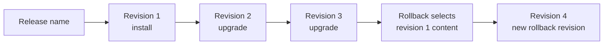

# Preserve evidence across the Helm release lifecycle

## TL;DR

Helm stores a named release as a sequence of revisions. Install creates the first
revision, upgrade creates another, history lists revisions, and rollback creates a
new revision based on an earlier one. [S1] [S2] [S3] [S4]

`--wait` changes when a command reports success. `--atomic` adds rollback or
install cleanup behavior and enables waiting. These options can reduce partial
state, but cleanup can also remove the failed resources needed for diagnosis.
Choose transactional behavior and diagnostic retention explicitly.

## When To Read

- Use when selecting `helm install` or `helm upgrade` failure flags.
- Use when a failed release is absent from expected history.
- Use when rollback is being treated as deletion of later revisions.
- Do not use release success as proof of application behavior.

## Knowledge

### Revision Model



Rollback does not rewind storage in place. Helm creates a new release revision
whose content is based on a prior revision. History remains the audit trail,
subject to configured history limits. [S3] [S4]

An upgrade combines chart values according to the command's reuse, reset, and
value-file options. The resulting release is a new evaluated input set, not
necessarily the previous values plus one small edit. [S2]

### Wait And Atomic Behavior

Install and upgrade `--wait` options wait for selected Kubernetes resources to
reach ready states until timeout. They do not run an application-specific user
journey. [S1] [S2]

For install, `--atomic` deletes the installation on failure and automatically
enables waiting. For upgrade, `--atomic` rolls back changes on failure and also
enables waiting. [S1] [S2] A failed atomic install can therefore leave less live
resource evidence than a non-atomic diagnostic attempt.

`--cleanup-on-fail` for upgrade allows deletion of newly created resources when
the upgrade fails. That controls cleanup, not root-cause capture. [S2]

### Evidence Contract

Before choosing failure behavior, decide which evidence the pipeline must retain:

- Helm command exit and bounded stderr;
- release status and revision history;
- rendered manifest identity without secret values;
- Kubernetes events and failed resource conditions;
- hook Job status and logs under approved access;
- the expected chart version and values source.

If atomic cleanup is required, capture safe status and event evidence before the
cleanup window closes, or reproduce in a controlled non-production target.

### Rollback Boundaries

Rollback can restore a previous release revision, but external state may not be
reversible. Database migrations, controller-managed resources, retained volumes,
external secrets, and out-of-band changes need their own recovery plan.

A rollback command can wait for Kubernetes readiness and hooks. It still does not
prove that persisted data and dependent services remain compatible. [S3]

### Common Mistakes

- **Assuming atomic means no side effects:** hooks and external systems can change
  before Helm rolls Kubernetes resources back.
- **Deleting failed evidence immediately:** the next investigation sees only a
  generic command failure.
- **Treating rollback as revision deletion:** rollback creates another revision.
  [S3] [S4]
- **Ignoring values merge flags:** reuse and reset behavior can change the final
  release inputs. [S2]
- **Equating wait success with application success:** readiness is narrower than
  a behavior check.

### Minimal Decision Model

```text
Need maximum automatic recovery?
  → Consider atomic behavior.
  → Define how bounded evidence is captured before cleanup.

Need to diagnose a new failure mechanism?
  → Preserve failed resources in a safe target.
  → Inspect release revision, events, hooks, and rendered intent.

Need rollback?
  → Select the exact prior revision.
  → Review data and external side effects.
  → Validate Kubernetes convergence and application behavior separately.
```

## Sources

| ID | Source | Accessed | Supports |
| --- | --- | --- | --- |
| S1 | [Helm install command](https://helm.sh/docs/helm/helm_install/) | 2026-09-13 | Install, wait, timeout, and atomic deletion behavior |
| S2 | [Helm upgrade command](https://helm.sh/docs/helm/helm_upgrade/) | 2026-09-13 | Upgrade values behavior, wait, atomic rollback, cleanup-on-fail, and history limits |
| S3 | [Helm rollback command](https://helm.sh/docs/helm/helm_rollback/) | 2026-09-13 | Rollback to a prior revision and rollback wait options |
| S4 | [Helm history command](https://helm.sh/docs/helm/helm_history/) | 2026-09-13 | Release revision history and maximum-history display |

## Related Notes

- [Treat a shared Helm chart as a versioned API](shared-helm-chart-contracts.md)
- [Order migration Jobs without creating a second release controller](migration-job-rollout-ordering.md)
