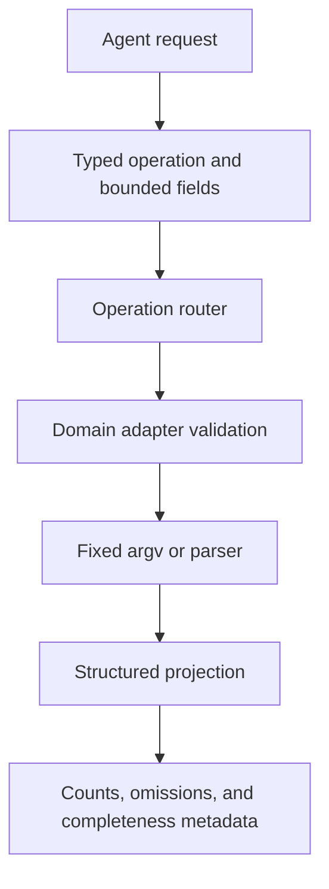

# Intent routing and adapter verification

## TL;DR

Translate an agent's request into a small typed intent before constructing a
command. The router selects a domain adapter; the adapter validates its input,
builds fixed arguments, and reports the projection's completeness. This
repository uses that arrangement for environment inspection and result
projection. The repository-specific behavior comes from current local source and
tests; an immutable public permalink is pending.

Pi custom tools can expose a TypeBox parameter schema and receive typed
parameters in their execution function. [S1] The API supplies the interface,
not the domain allowlist or verification policy.

## When To Read

- Use when a tool would otherwise accept a free-form shell command or filter.
- Use when one output format needs different summaries for different operations.
- Do not use a projection to infer facts absent from its selected fields.

## Knowledge

### Route Before Rendering



```text
agent request
  -> typed operation and bounded fields
  -> operation router
  -> domain adapter
  -> fixed argv or parser
  -> structured projection with completeness metadata
```

The router should decide only which supported adapter applies. Domain adapters
own operation-specific validation and parsing. A common budget layer can then
prune arrays while preserving counts, omission metadata, and an incomplete flag.
This division is a repository architecture choice.

For Pi, tool parameter definitions are part of the registered tool interface,
and `execute` receives the validated parameter object. [S1] Keep conversion from
agent-facing intent to external arguments in one reviewed adapter rather than
spreading it across prompts and callers.

### Trust Boundaries

A typed operation is narrower than free-form command text, not a proof that its
returned data is current, complete, or authorized. Pi extensions are privileged
code, so this interface does not replace source trust or host controls. [S2]
Verify separately:

- requested operation is allowlisted;
- identifiers, limits, time windows, and filters meet local grammar rules;
- exact arguments are generated without shell interpolation;
- parser rejects malformed or unexpected source data;
- output says when a cap, omission, or source truncation changes completeness.

If parsing fails, return bounded raw evidence or fail explicitly. Do not invent a
healthy summary from an unrecognized response.

### Common Mistakes

- **One generic adapter:** command-specific assumptions become hidden branches.
- **Free-form filters without bounds:** a syntactically valid request can exceed
  reviewable scope.
- **Treating no hits as no event:** a time window, permission, or projection
  limit can also produce an empty result.
- **Dropping omitted-count metadata:** readers cannot assess the summary.

### Minimal Example

This illustrative flow uses synthetic values:

```text
intent: { operation: "pods", namespace: "example", selector: "app=api" }
router: kubernetes adapter
adapter: validates each field and builds fixed kubectl argv
projection: unhealthy items first; item_count and omitted count retained
```

## Sources

| ID | Source | Accessed | Supports |
| --- | --- | --- | --- |
| S1 | [Pi extension types](https://github.com/earendil-works/pi/blob/38f18be44727e669eb0a6e2eb8edb51b0232d83c/packages/coding-agent/src/core/extensions/types.ts) | 2026-09-12 | Registered custom tools define parameters and execute with tool-call context. |
| S2 | [Pi extensions documentation](https://github.com/earendil-works/pi/blob/38f18be44727e669eb0a6e2eb8edb51b0232d83c/packages/coding-agent/docs/extensions.md) | 2026-09-12 | Extensions are privileged code, so tool interfaces do not replace source trust or host controls. |

## Related Notes

- [Deterministic context projection for tool results](deterministic-context-projection.md)
- [Prompt guidance is not enforcement](prompt-guidance-is-not-enforcement.md)
