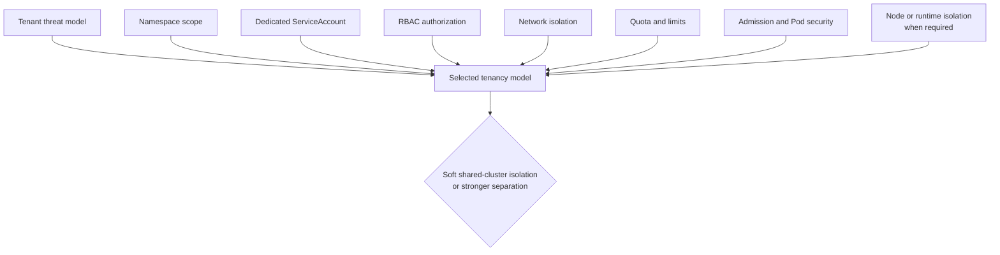

# Combine Kubernetes tenancy boundaries instead of trusting namespaces alone

## TL;DR

A namespace scopes names and many policy objects, but it is not a complete security
boundary. Kubernetes describes multi-tenancy as a spectrum: namespaces support
soft isolation, while stronger hostile-tenant separation can require additional
sandboxing or separate clusters. [S1]

Each workload should use a dedicated ServiceAccount with bounded RBAC. Network
policy, quotas, admission controls, secret access, and node isolation address
other paths that RBAC does not cover.

## When To Read

- Use when creating a namespace or moving a workload between namespaces.
- Use when several workloads share the default ServiceAccount.
- Use when evaluating cross-namespace roles or cluster-wide bindings.
- Do not claim hard tenant isolation from namespace creation alone.

## Knowledge

### Boundary Stack



Namespaces isolate names for namespaced objects and provide a scope for RBAC,
quotas, and policies. Cluster-scoped resources remain shared. [S1]

A ServiceAccount is a namespaced workload identity. Pods receive a default
ServiceAccount if none is specified, subject to admission behavior. Dedicated
accounts make workload grants and audit trails narrower than a shared default.
[S2]

### RBAC Scope

A Role grants permissions within one namespace. A ClusterRole can describe
cluster-scoped permissions or reusable namespaced permissions. RoleBinding grants
within a namespace; ClusterRoleBinding grants across the cluster. [S3]

Prefer namespace-scoped bindings when the operation is namespaced. Avoid wildcard
resources and verbs, and avoid granting workload identities permission to create
or modify RBAC objects, bind stronger roles, or access unrelated Secrets. [S3]

### Soft And Hard Multi-Tenancy

Soft multi-tenancy assumes some trust among tenants and uses shared cluster
controls. Harder isolation for mutually untrusted tenants may require sandboxed
workloads, dedicated nodes, virtual control planes, or separate clusters. [S1]
The correct boundary follows the threat model, not the count of namespaces.

### Namespace Moves Change Identity

A namespaced ServiceAccount identity includes its namespace. Moving a workload can
therefore change:

- ServiceAccount subject used by RBAC;
- cloud workload identity binding;
- Secret and ConfigMap references;
- NetworkPolicy selectors and default behavior;
- ResourceQuota and LimitRange application;
- DNS search names and Service resolution.

Treat a namespace move as an identity and policy migration, not a file-path edit.

### Boundaries

- RBAC controls Kubernetes API requests; it does not by itself isolate Pod network
  traffic or kernel access.
- NetworkPolicy depends on a supporting network implementation.
- ServiceAccounts are identities, not human user accounts. [S2]
- Disabling token automount can reduce unnecessary token exposure but does not
  remove other Pod permissions or credentials.
- Cluster administrators remain a high-trust boundary that namespace policy
  cannot constrain fully.

### Common Mistakes

- **Using the default ServiceAccount everywhere:** unrelated workloads share an
  identity and grants.
- **Binding ClusterRole with ClusterRoleBinding for a namespaced need:** the same
  role becomes effective cluster-wide.
- **Assuming namespace prevents network access:** network isolation needs explicit
  supported policy.
- **Renaming a ServiceAccount without updating external identity:** RBAC may work
  while cloud authorization fails, or the reverse.
- **Calling shared-cluster controls hard isolation:** node and control-plane paths
  may remain shared.

### Minimal Review

```text
For one workload:
1. Name its namespace and dedicated ServiceAccount.
2. List required Kubernetes API verbs and resources.
3. Bind them at the narrowest scope.
4. Define ingress and egress policy.
5. Apply resource and admission controls.
6. Decide whether the tenant threat model requires stronger runtime or cluster isolation.
```

## Sources

| ID | Source | Accessed | Supports |
| --- | --- | --- | --- |
| S1 | [Kubernetes multi-tenancy](https://kubernetes.io/docs/concepts/security/multi-tenancy/) | 2026-09-13 | Namespace-based soft multi-tenancy and stronger isolation options |
| S2 | [Kubernetes ServiceAccounts](https://kubernetes.io/docs/concepts/security/service-accounts/) | 2026-09-13 | Namespaced workload identities and Pod ServiceAccount behavior |
| S3 | [Kubernetes RBAC good practices](https://kubernetes.io/docs/concepts/security/rbac-good-practices/) | 2026-09-13 | Least privilege, binding scope, wildcard risk, and privilege-escalation paths |

## Related Notes

- [Prefer Workload Identity Federation for GKE over service account keys](workload-identity-over-service-account-keys.md)
- [Separate CI execution from Kubernetes target selection](ci-runner-agent-and-cluster-context-boundaries.md)
