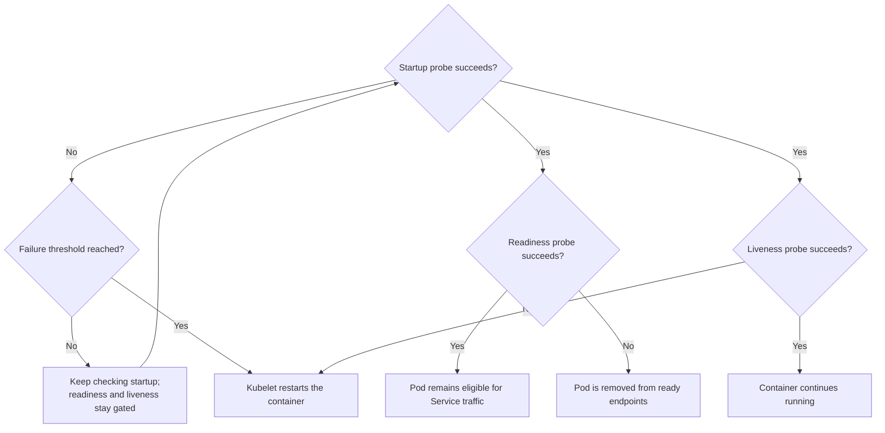

# Assign one purpose to each Kubernetes probe

## TL;DR

A startup probe answers whether initialization has completed. While it has not
succeeded, Kubernetes does not run readiness or liveness probes for that
container. A readiness failure removes the Pod from matching Service endpoints. A
liveness failure can restart the container according to its restart policy. [S1]

These probes are control signals, not a root-cause model. A liveness restart can
interrupt a slow but recoverable startup, and a readiness check can pass while a
user-facing dependency still fails.

## When To Read

- Use when containers restart before initialization completes.
- Use when Pods run but receive no Service traffic.
- Use when the same endpoint is proposed for all three probes.
- Do not add delay values without measuring the startup and failure boundaries.

## Knowledge

### Probe Responsibilities



A startup probe disables liveness and readiness checks until startup succeeds.
Its `failureThreshold × periodSeconds` defines the maximum startup probe window,
subject to probe timeout and execution behavior. [S1]

Readiness can continue throughout the container lifetime. A failed readiness
probe marks the Pod unready, and Services stop using it as a ready endpoint.
Liveness failure causes a container restart; repeated failures can produce a
backoff loop. [S1] [S2]

### Design From Failure Semantics

Choose a probe only after naming the desired control action:

- Initialization still progressing but within a measured bound: startup should
  keep liveness from killing it.
- Process can run but must temporarily stop receiving requests: readiness should
  fail.
- Process is irrecoverably wedged and restart is a valid repair: liveness should
  fail.
- External dependency is unavailable: decide whether removing all replicas from
  service or restarting them would improve recovery before including it.

A deep liveness probe that depends on a shared datastore can restart every replica
when that datastore fails. This adds churn without repairing the dependency.

### Timing Budget

Set thresholds from evidence:

```text
startup budget > expected high-percentile initialization time
readiness cadence = acceptable traffic-removal delay
liveness budget > transient pause or saturation window
```

Include probe `timeoutSeconds`, `periodSeconds`, success and failure thresholds,
and application response time. Initial delay does not replace a startup probe
when initialization duration varies widely.

### Boundaries

- Probe success reflects one diagnostic at one time; it does not prove full
  application correctness.
- Readiness affects traffic selection but does not restart the container. [S1]
- Liveness restarts the container but does not identify why it stopped responding.
- Pod phase and container readiness are different API fields. A Running Pod can be
  unready. [S2]
- Different controllers and load balancers can add health decisions beyond
  Kubernetes readiness.

### Common Mistakes

- **Using liveness for slow startup:** the kubelet can restart the container before
  it reaches a usable state.
- **Checking every dependency in liveness:** a shared outage can trigger a restart
  storm.
- **Using process existence as readiness:** a live process may not be able to
  serve requests.
- **Increasing thresholds without inspecting timing:** this delays symptoms but
  does not establish the failure mechanism.
- **Calling a liveness event the root cause:** it is the restart trigger; earlier
  evidence must explain why the probe failed.

### Minimal Example

```yaml
startupProbe:
  httpGet: {path: /started, port: 8080}
  periodSeconds: 5
  failureThreshold: 24
readinessProbe:
  httpGet: {path: /ready, port: 8080}
livenessProbe:
  httpGet: {path: /live, port: 8080}
```

This synthetic shape allows up to roughly two minutes of failed startup checks
before restart, then uses separate serving and restart signals. The values still
need workload measurements and failure testing.

## Sources

| ID | Source | Accessed | Supports |
| --- | --- | --- | --- |
| S1 | [Kubernetes liveness, readiness, and startup probes](https://kubernetes.io/docs/concepts/configuration/liveness-readiness-startup-probes/) | 2026-09-13 | Probe purposes, startup gating, readiness endpoint behavior, liveness restart behavior, and timing fields |
| S2 | [Kubernetes Pod lifecycle](https://kubernetes.io/docs/concepts/workloads/pods/pod-lifecycle/) | 2026-09-13 | Pod conditions, container restart behavior, and separation of Pod phase from health signals |

## Related Notes

- [Separate a restart trigger from its startup cause](../incidents/synthetic-startup-restart-causality.md)
- [Debug Kubernetes Service discovery from intent to endpoints](kubernetes-service-discovery-and-endpoint-debugging.md)
