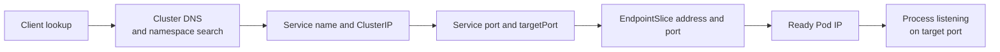

# Debug Kubernetes Service discovery from intent to endpoints

## TL;DR

A Kubernetes Service provides a stable virtual endpoint for a selected set of
backends. EndpointSlice objects represent those backends and their serving ports.
DNS resolves Service names according to the caller's namespace and search path.
[S1] [S2] [S3]

Debug in request order: name resolution, Service identity, port mapping, selector,
EndpointSlice membership and readiness, Pod IP reachability, then the process
listener. The Kubernetes debugging guide follows these distinct checks rather
than treating one object as proof of the full path. [S4] A Running Pod or existing
Service proves only one layer.

## When To Read

- Use when a Service name returns NXDOMAIN, connection refused, or timeout.
- Use when a Service has no ready endpoints.
- Use when `port`, `targetPort`, and container ports appear inconsistent.
- Use when a deployment check assumes every workload has a Service.
- Do not create a Service for workers or batch jobs that accept no inbound traffic.

## Knowledge

### Discovery Path



For a normal selector-based Service, the control plane finds matching Pods and
updates EndpointSlices. A Service without a selector can use manually managed
endpoints for external or custom backends. [S1] [S2]

EndpointSlices scale endpoint representation and include address, port, protocol,
and condition fields. Consumers can use readiness information when selecting
serving endpoints. [S2]

### DNS And Namespace

A short lookup such as `api` searches the client's namespace. A Service in
another namespace normally needs `api.other-namespace` or its full cluster domain.
Pod DNS policy and cluster DNS configuration can change the lookup path. [S3]

Start DNS diagnosis inside a representative client Pod. Host-machine resolution
or a Pod with a different DNS policy is not equivalent evidence.

### Ports And Selectors

Service `port` is the port clients use. `targetPort` selects the backend port or a
named container port. EndpointSlices reveal the resolved endpoint port. [S1]

For an empty endpoint set:

1. inspect the Service selector;
2. list candidate Pod labels in the same namespace;
3. inspect Pod readiness;
4. inspect EndpointSlice ownership and conditions;
5. confirm no custom controller or selectorless design owns the endpoints.

For populated endpoints with connection refusal, compare EndpointSlice ports with
the actual listener. For timeout, add NetworkPolicy, routing, and node-network
evidence.

### Workloads Without Services

A Service is needed when clients require stable inbound discovery or load
balancing. Queue consumers, scheduled Jobs, event-driven workers, and outbound-only
processes may correctly expose no Service.

Deployment validation should therefore follow an explicit workload contract:

```text
serving workload → validate Service, endpoints, route, and request
worker workload  → validate subscription, lease, queue, or completed work
batch workload   → validate Job completion and output contract
```

Resource absence is a failure only when the desired contract requires that
resource.

### Boundaries

- DNS success proves name resolution, not backend health.
- A ClusterIP proves Service allocation, not endpoint membership.
- Endpoint membership proves selection, not network reachability or process
  behavior.
- Pod readiness controls normal serving eligibility but does not prove every
  application operation.
- Service data-plane implementation varies by cluster and may use iptables, IPVS,
  eBPF, or another mechanism. Diagnose the API contract first.

### Common Mistakes

- **Testing the short name from another namespace:** search rules can produce
  NXDOMAIN even when the Service exists. [S3]
- **Reading containerPort as routing configuration:** it documents a Pod port;
  Service `targetPort` and EndpointSlices determine the backend mapping.
- **Checking selectors but not readiness:** matched unready Pods may not be used for
  normal traffic.
- **Recreating the Service before finding the broken layer:** this destroys useful
  evidence and may not change endpoint selection.
- **Requiring Services for all workloads:** non-serving workloads have different
  validation contracts.

### Minimal Diagnostic Sequence

```text
1. Resolve the exact Service FQDN from a representative client.
2. Inspect Service type, selector, port, and targetPort.
3. Inspect owned EndpointSlices and ready endpoint addresses and ports.
4. Compare Pod labels and readiness.
5. Verify the process listens on the endpoint port.
6. Test Pod IP, Service IP, then higher routing layers.
```

## Sources

| ID | Source | Accessed | Supports |
| --- | --- | --- | --- |
| S1 | [Kubernetes Service](https://kubernetes.io/docs/concepts/services-networking/service/) | 2026-09-13 | Service selectors, virtual endpoints, ports, targetPort, and selectorless Services |
| S2 | [Kubernetes EndpointSlices](https://kubernetes.io/docs/concepts/services-networking/endpoint-slices/) | 2026-09-13 | Endpoint representation, ownership, ports, addresses, and readiness conditions |
| S3 | [Kubernetes DNS for Services and Pods](https://kubernetes.io/docs/concepts/services-networking/dns-pod-service/) | 2026-09-13 | Service DNS records, namespace-qualified lookup, and Pod search behavior |
| S4 | [Kubernetes Debug Services](https://kubernetes.io/docs/tasks/debug/debug-application/debug-service/) | 2026-09-13 | Bounded diagnosis across DNS, Service, EndpointSlice, Pods, and data plane |

## Related Notes

- [Assign one purpose to each Kubernetes probe](kubernetes-probe-semantics-and-startup-order.md)
- [Trace GKE load-balanced requests across control planes](kubernetes-to-gcp-load-balancer-request-path.md)
