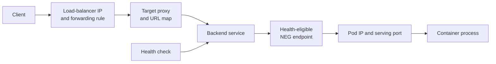

# Trace GKE load-balanced requests across control planes

## TL;DR

GKE Ingress translates Kubernetes Ingress and Service intent into Google Cloud
Application Load Balancer resources. With container-native load balancing, NEGs
contain Pod IP endpoints and the load balancer sends traffic to those endpoints
instead of traversing a node port. [S1]

Kubernetes readiness and load-balancer health are separate decisions. A Pod can
be ready while the backend health check fails because it probes a different port,
path, protocol, or network route.

## When To Read

- Use when the client receives 502, 503, timeout, or connection errors through a
  GKE Application Load Balancer.
- Use when a Kubernetes object looks healthy but a Google Cloud backend does not.
- Use when choosing between Ingress-managed and standalone NEGs.
- Do not assume this path applies to every GKE Gateway, passthrough Network Load
  Balancer, service mesh, or manually assembled load balancer.

## Knowledge

### Managed Ingress Path



The GKE Ingress controller creates a backend service for each referenced unique
Service name and port combination. The Kubernetes Service and Google Cloud
backend service are related but are not the same object and need not map one to
one. [S1]

With container-native load balancing, the NEG exposes Pod IP addresses as
endpoints. This removes the extra node-hop data path used by instance-group
backends, but it adds a separate NEG membership and backend-health surface. [S1]

### Standalone NEG Ownership

A standalone NEG lets Kubernetes manage endpoint membership while another tool or
operator manages load-balancer resources. GKE does not create the complete load
balancer for a standalone NEG. [S2]

Record one owner for each layer:

```text
Service annotation and endpoint membership → GKE NEG controller
backend service and health check           → infrastructure owner
URL map, proxy, forwarding rule            → infrastructure owner
application readiness                      → workload owner
```

Deleting or renaming a Service can alter NEG membership while external backend
resources still refer to the NEG. Review both control planes before changing the
boundary.

### Health And Serving Are Separate

A backend service sends new traffic only to endpoints that its health check
considers healthy. Health checks have their own protocol, port, request path, and
firewall requirements. [S3]

Debug from both ends:

1. Confirm the client reaches the intended forwarding rule and routing rule.
2. Map the selected backend service to the expected NEG.
3. Inspect NEG endpoint IPs and ports.
4. Check backend health and the exact health-check configuration.
5. Compare those ports and paths with Pod readiness and the listening process.
6. Verify firewall and route reachability from health-check and proxy systems.
7. Test application behavior only after the network path is established.

### Boundaries

- Ingress reconciliation can recreate managed cloud resources; direct edits can
  drift from Kubernetes intent. [S1]
- A ready Pod proves the kubelet readiness probe passed, not that the load
  balancer can reach the same endpoint.
- Stable NEG names preserve references but do not guarantee stable membership or
  health.
- Backend health proves probe success, not full application correctness.
- GKE behavior depends on load-balancer type, cluster networking mode, controller
  version, and whether resources are managed or standalone.

### Common Mistakes

- **Comparing only Kubernetes Service status:** the failing object may be the URL
  map, backend service, health check, NEG, or firewall.
- **Equating readiness with backend health:** the probes can use different
  settings and network origins.
- **Editing an Ingress-managed backend directly:** the controller can overwrite
  the change.
- **Treating a standalone NEG as a complete load balancer:** endpoint grouping
  does not create forwarding and routing resources. [S2]
- **Checking endpoint IP but not port:** a healthy Pod IP with the wrong backend
  port remains unusable.

### Minimal Example

```text
Kubernetes:
  Service port 80 → targetPort 8080
  Pod readiness  → GET :8080/ready

Google Cloud:
  backend NEG endpoint → pod-ip:8080
  health check         → GET serving-port/ready
```

Every arrow must agree. A mismatch at any one layer can remove all endpoints from
load-balancer service even while Pods remain Running.

## Sources

| ID | Source | Accessed | Supports |
| --- | --- | --- | --- |
| S1 | [Google Cloud GKE Ingress for Application Load Balancers](https://cloud.google.com/kubernetes-engine/docs/concepts/container-native-load-balancing) | 2026-09-13 | Ingress controller mapping, Google Cloud backend services, Pod-IP NEGs, and request routing |
| S2 | [Google Cloud standalone zonal NEGs](https://cloud.google.com/kubernetes-engine/docs/how-to/standalone-neg) | 2026-09-13 | Separation between GKE-managed NEG membership and separately managed load-balancer resources |
| S3 | [Google Cloud health check concepts](https://cloud.google.com/load-balancing/docs/health-check-concepts) | 2026-09-13 | Backend health-check purpose, configuration, and serving eligibility |

## Related Notes

- [Diagnosing a NEG health check port mismatch](../incidents/synthetic-neg-health-check-port-mismatch.md)
- [Debug Kubernetes Service discovery from intent to endpoints](kubernetes-service-discovery-and-endpoint-debugging.md)
