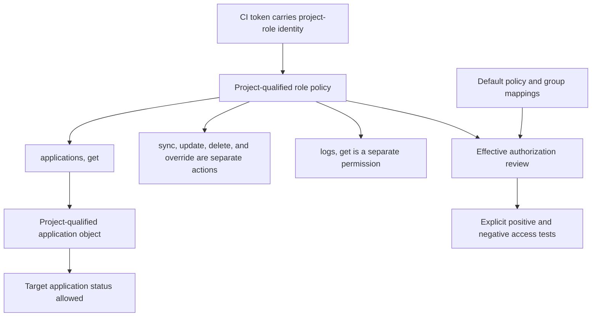

# Grant CI only the GitOps status access it uses

## TL;DR

Argo CD RBAC defines separate application actions for `get`, `sync`, `update`, and
`delete`. [S1] A CI identity that only checks application status should normally
receive `applications, get` on the narrowest project-qualified application
object. Do not add `sync`, `update`, `delete`, `override`, actions, or logs unless
the observed client request requires them.

Effective access is broader than one policy line. Review default policy, group
membership, project roles, token lifecycle, and any-namespace object format.
Argo CD states that permissions from the default policy cannot be removed by a
denial attached to one subject. [S1]

## When To Read

- Use when CI waits for or reports Argo CD application status.
- Use when creating a project-role token for automation.
- Use when a token described as read-only can still sync or inspect unrelated
  applications.
- Use when deciding whether status tooling needs Pod logs.
- Do not assume the word `readonly` in a role name proves effective permissions.
- Do not grant Kubernetes credentials when Argo CD status is the actual evidence
  source.

## Knowledge

### Application Action Boundary



Argo CD policies use subject, resource, action, object, and effect fields. The
application resource supports distinct `get`, `sync`, `update`, and `delete`
actions. [S1]

```text
p, proj:example-project:status-reader, applications, get, example-project/example-app, allow
```

This policy shape grants one application read action. It does not by itself grant
sync or update. Effective authorization can still include permissions inherited
from defaults or groups, so validate the final matrix rather than reading one
line in isolation.

### Project-Qualified Objects

For application policies, Argo CD uses an object in the form
`project-name/application-name`. When Applications in Any Namespace is enabled, the
format includes the application namespace. [S1]

Use the format required by the deployed Argo CD mode. A wildcard in either
segment can expose unrelated applications, and a policy copied from a cluster
with a different namespace mode can match incorrectly.

### AppProject Roles And Tokens

AppProject role subjects follow `proj:project-name:role-name`, and each role
policy must remain scoped to that project. Argo CD can issue JWTs associated with
a project role; policy changes then affect that token's authorization. [S2]

Treat authentication and authorization separately:

```text
CI token proves project-role identity
  → project-role policy authorizes applications,get
  → application object limits the readable target
```

Use an expiration and revocation model supported by the deployed version. Keep
token issuance, storage, rotation, and revocation outside Git and ordinary logs.

### Default Policy And Deny Rules

Argo CD grants every authenticated user at least the permissions in its default
policy. It states that subject-specific deny rules cannot remove those default
permissions. For policies evaluated beyond the default, a matching deny takes
priority over matching allows. [S1]

Review in this order:

1. anonymous-access configuration;
2. default policy;
3. direct subject policy;
4. project-role policy;
5. group mappings;
6. matching deny rules.

A narrow project-role grant cannot make a broad default grant narrow.

### Logs Are A Separate Permission

Argo CD defines a separate `logs, get` permission for viewing application Pod
logs. [S1] Add it only if the selected CI workflow requests logs and the
operational need accepts that data exposure.

Status, resource details, and logs can contain different sensitive information.
Test the actual client/API calls instead of granting a broad read role from
memory.

### AppProject Deployment Boundaries

AppProjects restrict trusted source repositories and allowed destination clusters
and namespaces. [S2] These controls constrain what applications may deploy. They
do not replace RBAC for who can read or mutate an Argo CD Application.

Review both planes:

- **RBAC plane:** what the CI identity can read or do;
- **project plane:** what source and destination an application may use.

A status-only token should not need broader deployment destinations or source
repositories.

### Validation Matrix

Test the token against an explicit matrix:

| Operation | Intended result |
| --- | --- |
| Get target application status | Allow |
| Get unrelated application | Deny |
| Sync target application | Deny |
| Update or delete target application | Deny |
| Invoke application action | Deny |
| Override application source | Deny |
| Read Pod logs | Deny unless separately approved |
| Access another project | Deny |

Then run the real status workflow. If it fails, inspect the denied resource,
action, and object before adding permission. Do not replace a precise denial with
a wildcard role.

### Token Lifecycle

- Bind the token to a project role, not a human identity.
- Set the shortest practical validity supported by the installation.
- Store it in an approved CI secret mechanism.
- Prevent token values from entering job logs, artifacts, caches, or debug traces.
- Revoke on role retirement, suspected exposure, or pipeline ownership change.
- Test policy changes with a non-production target before relying on them.

A repository change to RBAC does not prove the running Argo CD instance loaded the
policy. Verify the effective authorization through the deployed API.

### Boundaries

- `applications, get` is distinct from `sync`, `update`, and `delete`. [S1]
- Default policy can widen every authenticated user's access and cannot be
  subtracted by a subject-specific deny. [S1]
- AppProject source/destination restrictions govern deployment eligibility, not
  application read authorization. [S2]
- `logs, get` exposes log content and is not implied by a basic status need. [S1]
- Client behavior and policy object format can vary with Argo CD version and
  enabled features; verify the deployed release documentation.
- Argo CD read access does not require direct Kubernetes RBAC unless the workflow
  separately calls the Kubernetes API.

### Common Mistakes

- **Granting the built-in broad read role without measuring client calls:** the
  token can see more applications or data than required.
- **Adding `sync` to make a status command work:** the missing action should be
  identified from an authorization denial first.
- **Ignoring default policy:** a supposedly narrow role inherits broader access.
- **Using a project wildcard:** one pipeline can inspect unrelated applications.
- **Granting logs by default:** application logs can contain operational or
  sensitive data.
- **Treating source/destination restrictions as read RBAC:** the two controls
  solve different problems.
- **Naming a role `readonly` and skipping negative tests:** names are not policy
  evidence.

### Minimal Decision Model

```text
CI only needs application status?
  → Grant applications,get on one project-qualified application.

Client also requests Pod logs?
  → Decide separately whether logs,get is necessary and acceptable.

Narrow role still has broad access?
  → Inspect default policy and group grants before adding denies.

Policy is correct in Git?
  → Verify effective access against the deployed Argo CD instance.
```

## Sources

| ID | Source | Accessed | Supports |
| --- | --- | --- | --- |
| S1 | [Argo CD RBAC configuration](https://argo-cd.readthedocs.io/en/stable/operator-manual/rbac/) | 2026-09-11 | Policy syntax, application actions, object format, defaults, deny precedence, and logs permission |
| S2 | [Argo CD Projects](https://argo-cd.readthedocs.io/en/stable/user-guide/projects/) | 2026-09-11 | Project roles, JWT association, project-scoped policies, and source/destination restrictions |

## Related Notes

- [Replacing direct deployment with a GitOps handoff](direct-deploy-to-gitops-handoff.md)
