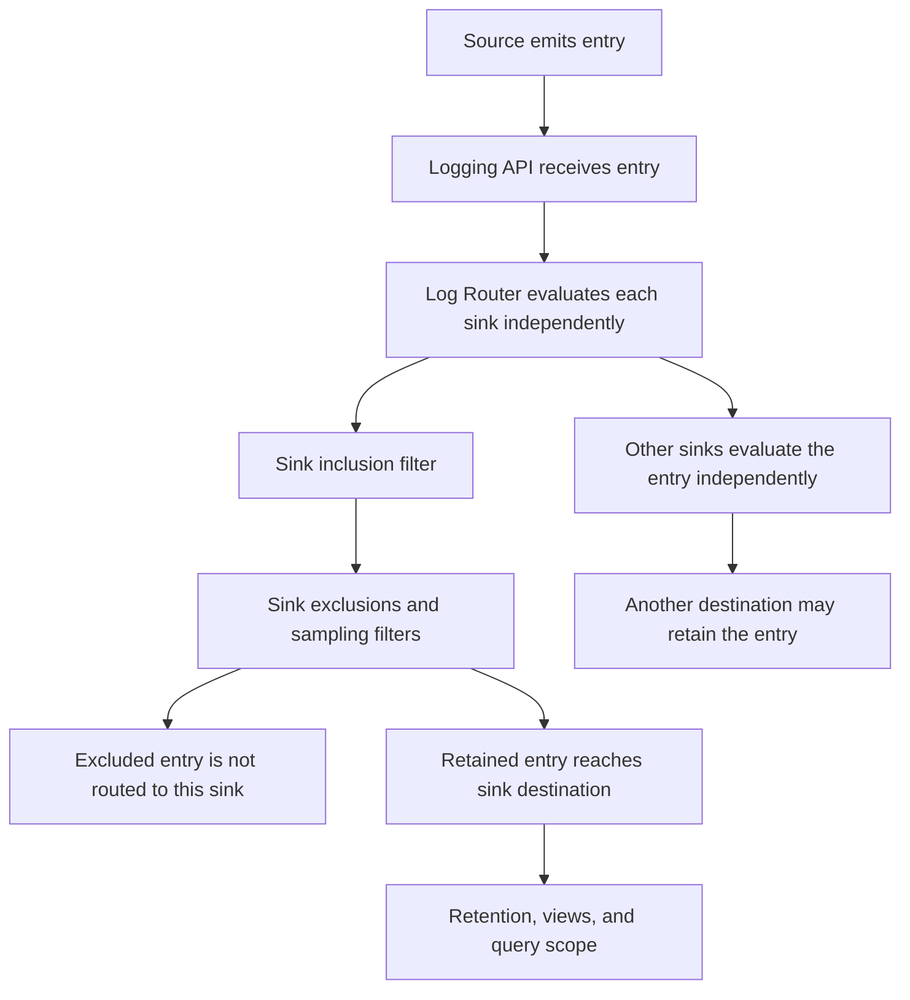

# Design log exclusions around diagnostic evidence

## TL;DR

A Cloud Logging exclusion is a sink routing rule. When an entry matches a sink's
inclusion filter and an exclusion filter, that sink does not route the entry to
its destination. Other sinks evaluate the entry independently. [S1]

Exclusions run after the Logging API receives entries, so they do not stop a
workload from emitting logs or reduce `entries.write` API calls. [S1] Preserve
error, audit, startup, scheduling, and dependency-failure evidence before
excluding repetitive low-value records. Validate source emission, API receipt,
routing, destination storage, retention, and Logs Explorer scope separately.

## When To Read

- Use when reducing log storage or routing cost.
- Use when changing the `_Default` sink or adding an exclusion to another sink.
- Use when sampling high-volume records.
- Use when an incident query cannot find an expected entry.
- Do not infer that a missing Logs Explorer result means the source never emitted
  the log.
- Do not attempt to modify the `_Required` sink.

## Knowledge

### Logging Evidence Path



```text
source emits entry
  → Logging API receives entry
  → Log Router evaluates each sink
  → inclusion filter
  → exclusion and sample filters
  → destination bucket or export
  → retention and views
  → Logs Explorer query scope
```

A failure at one layer cannot prove behavior at another. A workload can emit an
entry that reaches the Logging API but is excluded from one bucket. The same
entry can still exist in another routed destination.

### Sink-Scoped Exclusions

Cloud Logging evaluates inclusion and exclusion filters per sink. A matching
exclusion prevents routing to that sink's destination. [S1]

Before adding a filter, inventory every destination that needs the signal:

- operational log bucket;
- security or compliance bucket;
- project, folder, or organization aggregate sink;
- external analytics or archive destination;
- alert or metric path that depends on stored logs.

Do not write “excluded everywhere” unless every relevant sink and destination was
checked.

### `_Required` And `_Default`

The `_Required` sink routes specified audit logs to the `_Required` bucket. Google
states that this sink cannot be modified or deleted and that the bucket's stored
log set cannot be changed. It includes required audit categories such as Admin
Activity and System Event logs. [S1] [S2]

The `_Default` bucket stores entries not automatically stored in `_Required`.
The `_Default` sink can be modified or disabled and can contain additional
exclusions. [S1] [S2]

These built-in sinks have different policy roles. Do not use `_Default` behavior
to infer the retention or mutability of `_Required` audit evidence.

### Exclusions Do Not Stop Generation

Google documents that exclusion filters apply after entries are received by the
Logging API. They cannot reduce `entries.write` quota use or the number of write
calls. [S1]

If the cost or load occurs before routing, a sink exclusion cannot solve it. Check
whether the intended control belongs in:

- application log level or event generation;
- logging agent collection;
- API write volume;
- router destination storage;
- long-term retention;
- query or analysis behavior.

Changing source generation has a larger diagnostic blast radius than changing
one sink. Treat it as a separate decision.

### Preserve Failure Signals

Start from signals required to distinguish healthy from failed behavior:

- startup, readiness, liveness, and termination failures;
- scheduler, node, volume, and controller events;
- authentication and authorization failures;
- dependency timeout, refusal, and retry exhaustion;
- deployment and configuration revision identity;
- error and high-severity audit events;
- low-volume baseline records used by alerts or service-level indicators.

Then identify repetitive records that do not add a new state transition or
failure distinction. Filter on stable structured fields where possible. A broad
text fragment or severity threshold can remove unrelated diagnostic evidence.

### Sampling

Cloud Logging's `sample` function selects a fraction using deterministic hashing.
Google warns that non-uniform hash inputs can skew the result and that a field
with one repeated value can select all or none of the entries. [S3]

Use a high-cardinality, well-distributed field such as an appropriate unique
entry identifier when it matches the investigation need. Never assume a sampled
set contains every rare failure class. Keep errors and state transitions outside
a success-traffic sample unless another destination retains them.

### Logs Explorer Boundary

Logs Explorer retrieves entries stored in log buckets. [S4] A query can miss an
entry because of:

- sink exclusion;
- a different destination bucket;
- bucket view or log-scope selection;
- retention expiry;
- time-range or timezone mismatch;
- query-field mismatch;
- access restrictions;
- source or collection failure.

Check the intended bucket and view before changing the query. An entry excluded
from one sink is not queryable from that sink's destination, but it can remain in
another destination.

### Change Validation

Before enabling an exclusion:

1. measure candidate volume by structured category;
2. enumerate alerts, metrics, dashboards, incident queries, and exports that use
   the candidate entries;
3. test the filter against known failure examples and healthy baseline traffic;
4. confirm `_Required` and security destinations remain intact;
5. estimate storage reduction at the destination rather than source-write
   reduction;
6. define a rollback and observation window.

After enabling it:

- confirm expected noisy records stop reaching only the intended destination;
- inject or locate representative failure signals and confirm they remain
  queryable;
- verify alerts and log-based metrics still receive required records;
- compare sink errors, destination volume, and query results;
- inspect alternate destinations before concluding that data is absent.

### Boundaries

- Exclusions control routing, not workload emission or all ingestion cost. [S1]
- `_Required` has fixed audit-routing behavior. [S1] [S2]
- `_Default` is configurable but is not the only possible destination.
- Logs Explorer shows stored entries in the selected scope, not every entry ever
  generated. [S4]
- Deterministic sampling is repeatable for the hash input, not guaranteed to be
  representative. [S3]
- Retaining logs does not prove an alert, dashboard, or responder queries the
  right bucket and time range.

### Common Mistakes

- **Excluding all low-severity logs:** startup and controller context can be low
  severity before a later failure.
- **Filtering a broad message substring:** unrelated components can share text.
- **Assuming exclusions reduce write API calls:** they run after API receipt.
  [S1]
- **Treating `_Default` as the full audit archive:** `_Required` follows a
  separate fixed path. [S2]
- **Sampling on a constant field:** the result can contain all or none of the
  matching entries. [S3]
- **Using one successful query as retention proof:** the selected scope can hide
  another destination or view.

### Minimal Decision Model

```text
Need to reduce source generation or write calls?
  → Change source or collection behavior; a sink exclusion is too late.

Need to reduce one destination's stored volume?
  → Use a narrow sink exclusion and preserve diagnostic classes.

Need representative high-volume success traffic?
  → Sample on a suitable distributed field.
  → Keep rare failures outside the sample.

Expected log is missing?
  → Check emission, receipt, every sink, destination, retention, scope, and IAM.
```

## Sources

| ID | Source | Accessed | Supports |
| --- | --- | --- | --- |
| S1 | [Google Cloud route log entries](https://cloud.google.com/logging/docs/routing/overview) | 2026-09-11 | Per-sink routing, exclusion order, built-in sinks, and post-API filter timing |
| S2 | [Google Cloud store log entries](https://cloud.google.com/logging/docs/store-log-entries) | 2026-09-11 | `_Required` and `_Default` bucket content, mutability, and retention roles |
| S3 | [Google Cloud Logging query language](https://cloud.google.com/logging/docs/view/logging-query-language#sample) | 2026-09-11 | Deterministic sampling and skew or missing-field caveats |
| S4 | [Google Cloud Logs Explorer](https://cloud.google.com/logging/docs/view/logs-explorer-interface) | 2026-09-11 | Querying entries stored in selected log buckets and views |

## Related Notes

- [A liveness restart does not establish the startup root cause](../incidents/synthetic-startup-restart-causality.md)
