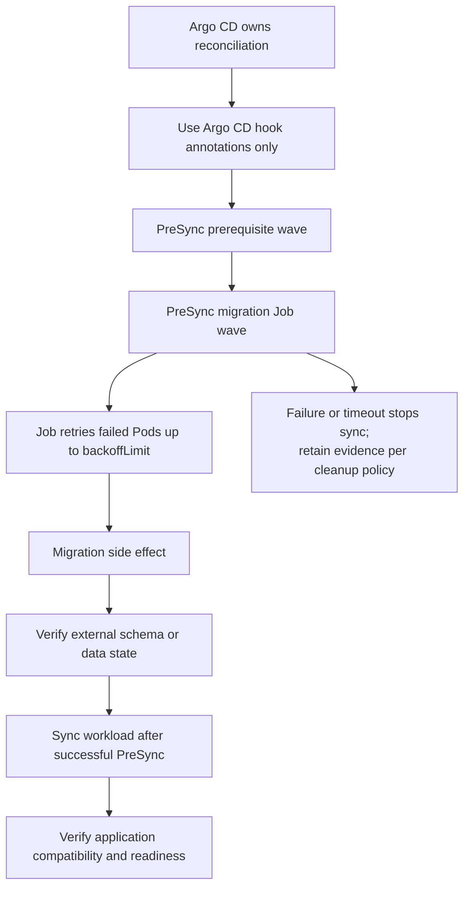

# Give migration Jobs one rollout-ordering owner

## TL;DR

A Kubernetes Job runs a one-off task to completion and retries failed Pods up to
its configured limit. [S1] Job completion proves the process exited successfully;
it does not prove that a database or external system reached the state the new
application expects.

Choose one rollout-ordering owner. For an Argo CD-managed application, use an
Argo CD `PreSync` Job and sync waves where prerequisites require ordering. Argo
CD starts ordinary `Sync` resources only after all `PreSync` hooks complete
successfully. [S2] Do not independently annotate the same Job with a second Helm
hook lifecycle.

## When To Read

- Use when a rollout requires a one-time schema, data, or control-plane change.
- Use when ordering a Secret, migration Job, and workload.
- Use when deciding between Argo CD hooks and Helm release hooks.
- Use when a migration might be retried after timeout or partial completion.
- Do not use Pod exit code alone as the migration's business-level validation.
- Do not run a non-backward-compatible migration before every old workload Pod
  has stopped using the old contract.

## Knowledge

### Four Different Contracts

```text
desired-state ordering
  → Job scheduling and retry
  → migration-side effect
  → application compatibility
```

Argo CD or Helm can order the Job relative to other resources. Kubernetes manages
Job Pods and completion. The migration program changes the external system. The
application must remain compatible with the resulting state. No one layer proves
the next.

### Kubernetes Job Semantics

Kubernetes Jobs represent one-off tasks that run to completion. A Job creates one
or more Pods and retries execution until the required number terminate
successfully. `backoffLimit` sets the retry limit before the Job is failed. [S1]

A retry repeats program side effects. The migration must therefore be one of:

- idempotent when the same version runs again;
- transactional with a verifiable commit boundary;
- guarded by a version table, lock, or equivalent external ownership mechanism;
- able to detect and stop on partial prior execution.

Set an explicit retry limit and active deadline from the migration's failure
model. Unlimited waiting can block delivery while hiding a stuck dependency.

### Argo CD Ordering



Argo CD sync phases provide lifecycle order: `PreSync` runs before ordinary
manifests, `Sync` runs after all `PreSync` hooks succeed, and `PostSync` runs after
Sync resources succeed and become healthy. [S2]

Sync waves add integer ordering within a phase. Argo CD starts with the lowest
wave and proceeds until all phases and waves are in sync and healthy. [S2]

```text
PreSync wave -2: identity or secret prerequisite
PreSync wave -1: migration Job
Sync wave 0: workload
PostSync wave 1: compatibility check
```

Use only the waves required by actual dependencies. A long wave chain makes
ownership and failure recovery harder to reason about.

If a `PreSync` Job fails, Argo CD stops and marks the sync failed. [S2] This is a
deployment barrier, not proof that a successful Job made the correct data change.

### One Hook System

Helm also supports `pre-install` and `pre-upgrade` hooks. Helm waits for hook Jobs
and Pods to complete; a failed hook fails the release. [S4]

Argo CD maps supported Helm hook annotations to Argo CD phases and maps Helm hook
weights to sync waves. It also states that defining any Argo CD hook causes all
Helm hooks to be ignored, and every Argo CD operation is a sync rather than a
known first install or upgrade. [S3]

For an Argo CD-owned application, prefer Argo CD annotations as the only ordering
contract. For a release owned directly by Helm, use Helm hooks. Do not depend on
both systems interpreting the same Job independently.

### Cleanup And Evidence

Argo CD hook deletion policies include deletion after success, after failure, or
before creating the next hook. Without an explicit policy, Argo CD assumes
`BeforeHookCreation`. [S2]

Helm hook resources are not tracked or managed as normal release resources, and
`helm uninstall` cannot be assumed to remove them. Helm also supports explicit
hook deletion policies. [S4]

Choose cleanup from the evidence need:

- keep failed Jobs long enough to inspect conditions and logs;
- remove successful Jobs only after recording the migration version/result;
- use stable names only with a clear before-create replacement model;
- avoid two independent TTL/deletion owners that can erase evidence early.

Argo CD cautions against a Job TTL that removes the hook before Argo CD reads its
result. [S2]

### Compatibility Strategy

Prefer expand-and-contract migrations:

1. expand the schema or data model in a way old and new application versions can
   both use;
2. deploy code that uses the new contract while retaining old compatibility;
3. verify the new path;
4. remove the old contract in a later, separately reviewed migration.

This reduces the need for a strict instant cutover. Hook ordering still matters,
but a delayed or partially rolled-out workload is less likely to become
incompatible with the datastore.

### Validation

Before sync:

- confirm one hook annotation family owns the Job;
- inspect the rendered phase, wave, name, service account, command, retry limit,
  deadline, and cleanup policy;
- verify required Secrets and network dependencies exist in an earlier phase or
  wave;
- prove the migration is safe after retry or partial execution;
- define the expected pre- and post-migration version/state check.

During sync:

- verify prerequisites become healthy before the migration wave;
- inspect Job conditions and every Pod attempt;
- stop on timeout, unknown prior execution, or unexpected side effects;
- confirm workload resources do not apply after a failed `PreSync` Job.

After sync:

- verify the external schema/data version independently of Job exit status;
- verify old and new application versions remain compatible during rollout;
- verify workload readiness and key behavior;
- retain enough evidence for retry, rollback, or forward repair;
- confirm cleanup follows the declared policy.

### Boundaries

- Kubernetes Job completion is process evidence, not database correctness. [S1]
- Sync waves order resources; they do not make a migration transactional. [S2]
- Argo CD health gates rely on available resource health assessment.
- Helm hook resources have different release-ownership semantics from normal
  chart resources. [S4]
- A destructive or one-way migration may require backup, restore, maintenance,
  or application fencing beyond hook ordering.
- Rollback of application manifests does not automatically reverse a migration.

### Common Mistakes

- **Using both Argo CD and Helm hooks:** one system can ignore or reinterpret the
  other's lifecycle. [S3]
- **Relying on default Job retries:** the migration's side-effect behavior remains
  undefined under repetition.
- **Deleting failed Jobs immediately:** the strongest execution evidence
  disappears before diagnosis.
- **Treating exit zero as schema proof:** the program can exit successfully after
  a partial or semantically wrong change.
- **Running a breaking migration before rollout:** old Pods can remain active
  during deployment and use the previous contract.
- **Assuming application rollback reverses data:** schema and data changes have a
  separate recovery surface.

### Minimal Decision Model

```text
Argo CD owns reconciliation?
  → Use Argo CD PreSync and waves as the only hook ordering contract.

Helm directly owns release lifecycle?
  → Use Helm hooks and explicit deletion policy.

Migration can retry?
  → Prove idempotency or a transaction/version guard.

Job completed?
  → Verify external state and application compatibility separately.
```

## Sources

| ID | Source | Accessed | Supports |
| --- | --- | --- | --- |
| S1 | [Kubernetes Jobs](https://kubernetes.io/docs/concepts/workloads/controllers/job/) | 2026-09-11 | One-off completion, Pod retries, and `backoffLimit` behavior |
| S2 | [Argo CD sync phases and waves](https://argo-cd.readthedocs.io/en/latest/user-guide/sync-waves/) | 2026-09-11 | Hook phases, wave ordering, health gates, failures, and deletion policies |
| S3 | [Argo CD Helm integration](https://argo-cd.readthedocs.io/en/latest/user-guide/helm/#helm-hooks) | 2026-09-11 | Helm-hook mapping, ignored-hook boundary, and sync lifecycle semantics |
| S4 | [Helm chart hooks](https://helm.sh/docs/topics/charts_hooks/) | 2026-09-11 | Hook timing, blocking Job behavior, deletion policies, and release ownership limits |

## Related Notes

- [Replacing direct deployment with a GitOps handoff](direct-deploy-to-gitops-handoff.md)
- [Treat a shared Helm chart as a versioned API](shared-helm-chart-contracts.md)
