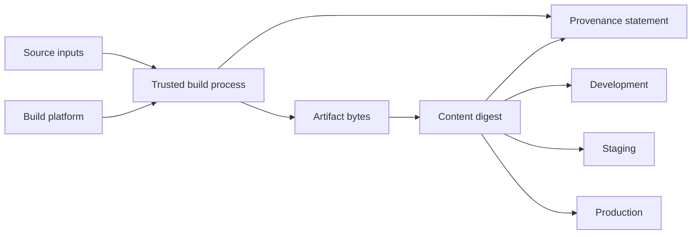

# Promote one immutable artifact with verifiable provenance

## TL;DR

A content digest identifies exact bytes. A mutable tag is a convenient name that
can later resolve to different content. Kubernetes documents that image digests
are immutable while tags can move. [S3]

SLSA provenance is verifiable information about where, when, and how an artifact
was produced. [S1] Provenance and digest answer different questions: the digest
identifies the output; provenance links that output to build inputs and process.
Promotion should move the same digest and associated provenance rather than
rebuilding from the same source for each environment.

## When To Read

- Use when a release pipeline rebuilds for each environment.
- Use when a manifest records only an image tag.
- Use when deciding what provenance proves and what deployment evidence must prove.
- Do not treat provenance as proof that runtime configuration or behavior is safe.

## Knowledge

### Identity And Provenance



OCI descriptors include a digest and size for referenced content. The digest
allows content-addressed verification of the descriptor target. [S2]

SLSA provenance describes an artifact's build platform, process, and external
parameters and identifies output subjects by digest. A verifier still needs a
trust policy for the builder and expected source inputs. [S1]

### Build Once, Promote By Reference

A promotion workflow should preserve:

- artifact digest;
- provenance subject digest;
- builder and source identity expected by policy;
- attestations such as test or scan results, each with its own scope;
- the desired-state revision that selects the artifact.

Copying an image between registries can preserve identity only if the copied
manifest and referenced content retain the expected digest semantics. Verify the
destination digest instead of assuming a copy command preserved it.

Rebuilding from the same commit creates a new build event and can produce
different bytes because toolchains, dependencies, timestamps, or base images
changed. The new output needs its own digest and provenance.

### Evidence Layers

```text
provenance verification → expected builder and inputs produced this digest
registry verification   → requested digest content is available
GitOps desired state    → target selects this digest
controller status       → runtime resources reconciled to desired state
runtime verification    → workload actually runs and behaves as expected
```

No layer substitutes for the next. Provenance does not prove deployment, and a
running image does not prove its build origin unless identity is checked.

### Boundaries

- A tag can be protected by registry policy, but the tag syntax itself is mutable.
  [S3]
- A digest establishes content identity, not that the content is trustworthy.
- Provenance quality depends on how securely the builder generated it and what
  the verifier requires. [S1]
- Signing a statement proves control of a signing identity; policy must decide
  whether that identity and statement are acceptable.
- Runtime configuration, secrets, and external dependencies can change behavior
  without changing the application image digest.

### Common Mistakes

- **Rebuilding per environment:** each environment receives a different artifact
  even when the source revision is the same.
- **Recording only a tag:** history cannot prove which bytes the tag referenced at
  deployment time.
- **Checking that provenance exists:** existence without subject, builder, source,
  and policy verification is weak evidence.
- **Equating digest with safety:** immutable vulnerable content remains vulnerable.
- **Losing provenance during registry copy:** artifact availability and attached
  metadata need separate destination checks.

### Minimal Promotion Contract

```text
Build output:
  image = registry.example.test/service@sha256:<digest>
  provenance.subject = sha256:<same digest>

Promotion:
  verify provenance policy
  copy or expose the same digest
  update desired state to the same digest
  verify controller revision and runtime image identity
```

## Sources

| ID | Source | Accessed | Supports |
| --- | --- | --- | --- |
| S1 | [SLSA provenance specification v1.2](https://slsa.dev/spec/v1.2/provenance) | 2026-09-13 | Provenance purpose, build metadata, external parameters, subjects, and digest binding |
| S2 | [OCI Image Specification descriptor](https://github.com/opencontainers/image-spec/blob/af26a05fba5ee648512f4ea3c9fda1fcc1b6d6dc/descriptor.md) | 2026-09-13 | Content descriptors, digests, sizes, and content-addressed references |
| S3 | [Kubernetes images](https://kubernetes.io/docs/concepts/containers/images/) | 2026-09-13 | Mutable image tags and immutable image digests |

## Related Notes

- [Replacing direct deployment with a GitOps handoff](direct-deploy-to-gitops-handoff.md)
