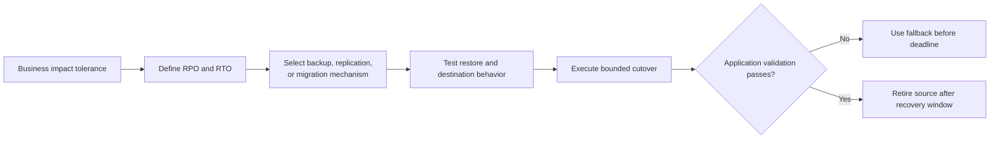

# Define recovery objectives before changing a datastore

## TL;DR

Recovery point objective (RPO) defines the acceptable data-loss interval.
Recovery time objective (RTO) defines the acceptable service-restoration time.
Google Cloud disaster-recovery guidance uses both to select recovery architecture
and operational procedures. [S1] [S2]

A backup, replica, or migration job is not a recovery result. Before a datastore
change crosses an irreversible boundary, prove that the recovery artifact is
usable, estimate restoration and cutover time, define write ownership, and test
application behavior against the recovered or destination system.

## When To Read

- Use before version upgrades, replacements, engine changes, migrations, or
  datastore deletion.
- Use when a plan says “backup exists” without a restore test.
- Use when cutover can leave two writable systems or lose recent writes.
- Do not combine unrelated data engines into one procedural runbook; adapt this
  decision model to the selected product.

## Knowledge

### Objectives Drive Mechanisms



A nightly backup cannot meet a five-minute RPO. A replica may reduce RPO but still
miss RTO if promotion, credentials, DNS, schema compatibility, or client restart
takes too long. Select mechanisms from the objectives instead of assigning
objectives after implementation.

### Recovery Evidence Ladder

1. A policy says backups or snapshots should exist.
2. The control plane reports a completed recovery artifact.
3. Integrity checks can read the artifact.
4. A restore produces a reachable isolated datastore.
5. Schema, users, permissions, extensions, and required data are present.
6. The application completes representative reads and writes.
7. Measured recovery and data loss satisfy RTO and RPO.

Only the later layers test recovery behavior. Preserve restoration logs and
measurements without copying customer data or credentials into the wiki or change
record.

### Migration And Cutover

Google Cloud's database migration guidance separates preparation, initial load,
ongoing replication, validation, cutover, and fallback planning. [S3] [S4]

A safe cutover names one write authority at each step:

```text
source writable, destination replicating
→ writes paused or fenced
→ final replication lag checked
→ destination promoted
→ clients switch
→ application validation
→ source retained read-only for bounded fallback window
```

The exact sequence depends on product capabilities. Bidirectional writes are not a
default fallback; they require a tested conflict and identity model.

### Irreversible Boundary

Define the action after which fallback becomes slower, lossy, or impossible. It
might be destructive schema migration, source deletion, credential revocation,
replication detachment, or new writes that the old engine cannot interpret.

Before that point, require:

- current backup or replication evidence aligned with RPO;
- tested restore or rollback procedure aligned with RTO;
- schema and client compatibility checks;
- capacity, quota, network, identity, and observability readiness;
- a stop condition and named decision owner.

### Boundaries

- High availability handles selected component failures; it does not replace
  backup against deletion, corruption, or operator error.
- Replication can copy corruption and destructive writes.
- Provider-level success does not prove application queries, transactions, or
  latency meet requirements.
- Terraform rollback changes infrastructure intent; it does not reverse persisted
  data mutations.
- RPO and RTO are workload requirements, not universal product constants.

### Common Mistakes

- **Calling a snapshot a rollback plan:** restoration time and compatibility remain
  unknown.
- **Deleting the source after connection success:** representative reads, writes,
  jobs, and dependency behavior may still fail.
- **Ignoring writes during DNS or client-pool transition:** old and new clients can
  diverge.
- **Testing only control-plane status:** engine health does not prove application
  semantics.
- **Using one recovery target for every environment:** business impact and data
  characteristics differ.

### Minimal Change Record

```text
RPO: maximum acceptable lost writes
RTO: maximum acceptable unavailable time
recovery artifact: type, age, retention, restore test result
write owner: before, during, and after cutover
irreversible boundary: exact action
fallback deadline: last safe decision point
validation: representative application reads, writes, and background work
```

## Sources

| ID | Source | Accessed | Supports |
| --- | --- | --- | --- |
| S1 | [Google Cloud disaster recovery planning guide](https://cloud.google.com/architecture/dr-scenarios-planning-guide) | 2026-09-13 | RPO, RTO, recovery planning, and validation considerations |
| S2 | [Google Cloud disaster recovery architecture](https://cloud.google.com/architecture/disaster-recovery) | 2026-09-13 | Recovery objectives, failure scope, and architecture tradeoffs |
| S3 | [Google Cloud database migration concepts, part 1](https://cloud.google.com/architecture/database-migration-concepts-principles-part-1) | 2026-09-13 | Migration terminology, assessment, consistency, and architecture planning |
| S4 | [Google Cloud database migration concepts, part 2](https://cloud.google.com/architecture/database-migration-concepts-principles-part-2) | 2026-09-13 | Migration execution, validation, cutover, fallback, and post-migration behavior |

## Related Notes

- [Order migration Jobs without creating a second release controller](migration-job-rollout-ordering.md)
- [Keep stateful rollouts within volume and application safety boundaries](stateful-volume-safe-rollouts.md)
