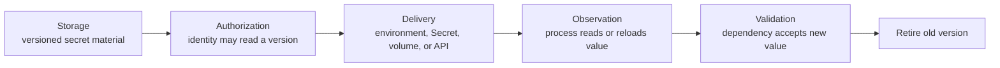

# Separate secret storage, delivery, authorization, and rotation

## TL;DR

Secret storage, authorization, delivery, and application reload are separate
mechanisms. Kubernetes Secrets can be exposed as volumes or environment variables,
but base64 representation is not encryption and cluster storage needs encryption
and access controls. [S1] [S2]

An external secret manager can keep the source value outside Kubernetes and mount
it through a CSI integration. Rotation can create or select a new secret version,
but the application must still re-read the mounted value or restart according to
its own behavior. [S3] [S4] [S5]

## When To Read

- Use when choosing environment variables, files, synchronized Kubernetes Secrets,
  or an external-secret CSI mount.
- Use when a rotated value exists but Pods still use the old value.
- Use when reviewing secret bundles, per-workload secrets, or access scope.
- Do not place real values, tokens, kubeconfig, or secret payloads in diagnostics.

## Knowledge

### Four Contracts



Changing one contract does not update the others automatically.

Kubernetes Secrets are API objects. By default, their values are base64-encoded
and may be stored unencrypted in etcd unless encryption at rest is configured.
Kubernetes recommends least-privilege access, encryption at rest, and restricting
Secret access to containers that need it. [S1] [S2]

### Delivery Choices

- **Environment variable:** simple, but the process receives a snapshot at start.
  A later Secret update does not change the existing process environment.
- **Kubernetes Secret volume:** kubelet updates projected files eventually, but an
  application that reads only at startup still needs restart or reload behavior.
  [S1]
- **External-manager CSI mount:** the source remains in the external system and
  the node integration mounts authorized values. Provider and platform behavior
  determine refresh timing and supported modes. [S4]
- **Direct API fetch:** gives the application control over version selection and
  caching, but adds client, retry, authorization, and failure-path responsibility.

Select one authoritative source for each value. Copying the same secret into
several systems creates several rotation and revocation paths.

### Rotation Sequence

A complete rotation has at least these states:

```text
new version created
→ consumers are authorized
→ delivery path exposes new version
→ application observes new value
→ dependent service accepts new value
→ old version disabled or destroyed after validation
```

Secret Manager rotation schedules emit rotation notifications; they do not rotate
the secret value automatically. [S5] A separate rotation workflow must create the
new material, coordinate consumers, validate use, and retire the old version.

For credentials that permit overlap, a two-version window can avoid outages. For
credentials that invalidate immediately, define ordering and recovery before
rotation.

### Boundaries

- A secret name is not a permission boundary; IAM or Kubernetes RBAC controls
  retrieval.
- Encoding is not encryption. [S1]
- A mounted-file update is not proof that the process reopened the file.
- Restart automation is a delivery response, not the source of truth for rotation.
- Secret Manager best practices advise referencing version numbers rather than
  the `latest` alias for deterministic deployments. [S3]
- Broad secret bundles widen the set of values exposed when one workload is
  compromised.

### Common Mistakes

- **Rotating only the stored value:** consumers can keep cached or startup-only
  copies.
- **Using environment variables for hot reload:** existing process environments do
  not change.
- **Granting project-wide secret access:** one workload then reads unrelated
  values.
- **Synchronizing without ownership:** operators cannot tell whether Kubernetes or
  the external manager owns deletion and rotation.
- **Deleting the old version before validation:** consumers that have not reloaded
  lose access.

### Minimal Review

```text
For one secret, record:
- authoritative store and version policy
- workload identity and exact read grant
- delivery form and refresh interval
- application read or reload behavior
- overlap and revocation order
- safe validation that reveals no secret value
```

## Sources

| ID | Source | Accessed | Supports |
| --- | --- | --- | --- |
| S1 | [Kubernetes Secrets](https://kubernetes.io/docs/concepts/configuration/secret/) | 2026-09-13 | Secret delivery as environment variables or volumes, update behavior, and base64 boundary |
| S2 | [Kubernetes Secrets good practices](https://kubernetes.io/docs/concepts/security/secrets-good-practices/) | 2026-09-13 | Encryption at rest, least privilege, and limiting container access |
| S3 | [Google Cloud Secret Manager best practices](https://docs.cloud.google.com/secret-manager/docs/best-practices) | 2026-09-13 | Least privilege, version references, caching, and secret-handling guidance |
| S4 | [Google Cloud Secret Manager add-on for GKE](https://docs.cloud.google.com/secret-manager/docs/secret-manager-managed-csi-component) | 2026-09-13 | CSI-based delivery of Secret Manager values to GKE workloads |
| S5 | [Google Cloud Secret Manager rotation schedules](https://docs.cloud.google.com/secret-manager/docs/rotation-recommendations) | 2026-09-13 | Rotation notifications and the boundary between scheduling and changing secret data |

## Related Notes

- [Prefer Workload Identity Federation for GKE over service account keys](workload-identity-over-service-account-keys.md)
