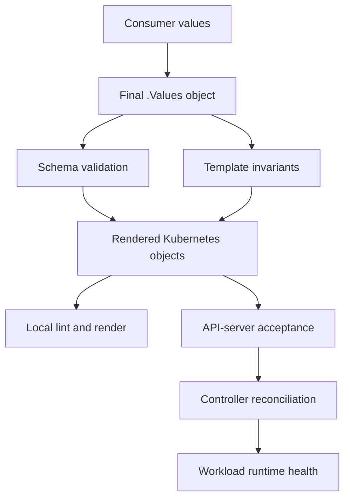

# Treat a shared Helm chart as a versioned API

## TL;DR

A shared Helm chart has two compatibility surfaces:

1. the final `.Values` object accepted by schemas and templates;
2. the Kubernetes resources rendered from those values.

Helm applies `values.schema.json` to final values during install, upgrade, lint,
and template operations, including subchart schemas. [S1] Template checks can
reject missing or incompatible values, but a successful local render does not
prove that the target API server accepts the resources or that the workload will
be healthy. [S2] [S7]

Version changes as API changes. Preserve old inputs during a documented migration
window or publish a breaking version with a clear upgrade path.

## When To Read

- Use when adding, removing, renaming, or changing the type of a chart value.
- Use when a default changes the rendered resource set or runtime behavior.
- Use when changing helper templates, selectors, labels, names, hooks, or
  controller ownership.
- Use when upgrading a dependency or widening its accepted version range.
- Do not treat `helm lint` or `helm template` success as deployment proof.
- Do not validate only the chart's default `values.yaml`; consumers supply the
  effective contract.

## Knowledge

### Two Contracts



```text
consumer values
  → schema and template contract
  → rendered Kubernetes objects
  → API-server acceptance
  → controller and workload behavior
```

The values contract includes keys, types, required fields, defaults, enum/range
rules, and cross-field invariants. The rendered-resource contract includes kinds,
API versions, names, selectors, labels, ports, identities, ownership, lifecycle,
and availability behavior.

A values change can be breaking even when every resource name stays the same. A
template change can be breaking even when the values interface stays unchanged.

### Schema Validation

Helm validates `values.schema.json` during install, upgrade, lint, and template.
The schema applies to final `.Values`, not only the chart's `values.yaml`, and a
parent chart cannot bypass a subchart schema because final values are checked
against all subchart schemas. [S1]

Use schema for machine-checkable input rules:

- object, string, number, integer, array, and boolean types;
- required keys;
- enums and numeric/string constraints;
- whether optional sections are shaped correctly when present.

Schema validates declared structure. It does not know every Kubernetes or
application invariant.

### Template-Level Invariants

Helm's `required` function stops rendering when a required value is empty or
undefined. The `fail` function returns an error unconditionally when a template
condition selects it. [S2]

Use these checks for actionable, template-specific rules such as:

```text
KEDA enabled → at least one trigger required
external secret enabled → secret reference required
migration Job enabled → service account and command required
legacy and replacement inputs set together → fail
```

Prefer schema when JSON Schema can express the rule. Use template failures for
cross-field or rendering conditions that schema cannot express clearly. Error
text should name the invalid contract and the accepted alternatives.

### Rendered-Resource Compatibility

Inspect rendered behavior, not only YAML validity. A shared-chart change can
alter:

- Deployment selectors or Pod labels;
- Service selectors, type, and ports;
- HPA or KEDA ownership;
- PDB availability policy;
- service account and cloud identity binding;
- ConfigMap keys and secret references;
- hook or Job ordering;
- resource names used by other controllers;
- immutable Kubernetes fields.

Representative renders need both common and boundary profiles: feature disabled,
feature enabled with minimum inputs, existing legacy inputs, and incompatible
combinations expected to fail.

### Named Template Namespace

Helm named templates are global. If two templates have the same name, the last
loaded definition wins. Parent and subchart templates are compiled together, so
Helm recommends chart-specific names. [S3]

Prefix public helpers with the chart name. If a helper's output contract changes
incompatibly, use a versioned helper name during migration rather than silently
changing every consumer.

### Version And Dependency Contract

Helm chart versions use SemVer compatibility signals. [S4] A dependency version
range defines which dependency releases the wrapper may resolve, while a lock
file records one resolution. Helm's dependency guidance recommends patch-level
ranges where possible. [S5]

Review both sides of a dependency change:

- Does the range admit a breaking chart release?
- Does the lock file resolve the expected version?
- Do global values, helper names, resource ownership, and rendered selectors
  remain compatible?
- Does the wrapper need a values migration before widening the range?

A dependency archive update without a rendered behavior comparison is package
evidence, not compatibility evidence.

### Validation Layers

1. **Schema:** validate representative final values, including subcharts.
2. **Lint:** run chart checks with dependencies included where applicable.
3. **Render:** compare changed resource kinds and behavior-critical fields.
4. **Negative cases:** prove invalid or incompatible values fail with useful
   messages.
5. **API server:** use server-side validation against the intended Kubernetes
   version when available.
6. **Controller behavior:** inspect ownership, reconciliation, rollout, Jobs,
   scaling, and admission results.
7. **Runtime:** verify readiness and the application behavior changed by the
   chart.

`helm lint` checks that a chart is well formed and reports errors or warnings.
[S6] `helm template` renders locally; Helm states that in-cluster lookups are
faked and server-side API support checks are not performed locally. A server
dry-run adds API-server interaction but remains a simulation. [S7]

### Compatibility Review

Classify every chart change before release:

| Change | Typical compatibility risk |
| --- | --- |
| Optional value with no rendered change by default | Additive, but validate false/default path |
| New required value | Breaking for existing consumers |
| Value type or meaning change | Breaking even if key is unchanged |
| Default enables a resource | Behavioral and ownership change |
| Selector, name, or immutable field change | Replacement or outage risk |
| Helper output change | Cross-chart rendering risk |
| Dependency range widening | Admits previously untested behavior |
| Hook or Job change | Ordering, retry, and cleanup risk |

SemVer classification follows the consumer-visible behavior, not the number of
lines changed.

### Boundaries

- Schema success proves final values satisfy declared schema, not that templates
  express the intended behavior. [S1]
- Local rendering does not validate target-cluster API support. [S7]
- Server dry-run does not prove rollout, controller convergence, storage
  attachment, or application health.
- A shared chart owns reusable defaults and rendering contracts; service-specific
  policy should remain in service values unless the platform intends to support
  it for every consumer.
- A default that changes resource ownership requires the same review as an
  explicitly enabled feature.

### Common Mistakes

- **Validating only default values:** real consumers can combine parent,
  environment, and subchart inputs into a different final object. [S1]
- **Making a new value required in a patch release:** existing consumers fail
  before any workload change.
- **Using generic helper names:** global named templates can override one another.
  [S3]
- **Checking only rendered YAML syntax:** selectors, identity, ownership, and
  lifecycle can be valid YAML but incompatible behavior.
- **Treating lint as runtime validation:** lint checks chart structure, not
  workload health. [S6]
- **Assuming a dependency range is harmless:** a wider range changes the set of
  accepted implementations.
- **Keeping legacy inputs without a rejection rule:** conflicting old and new
  values create ambiguous ownership.

### Minimal Decision Model

```text
Input shape changes?
  → Update schema, examples, negative tests, and compatibility classification.

Rendered resource behavior changes?
  → Compare affected fields for representative consumers.

Helper or dependency changes?
  → Review global namespace, SemVer range, lock resolution, and subchart values.

Local checks pass?
  → Continue to API-server and behavior validation; do not stop at render success.
```

## Sources

| ID | Source | Accessed | Supports |
| --- | --- | --- | --- |
| S1 | [Helm schema files](https://helm.sh/docs/topics/charts/#schema-files) | 2026-09-11 | Final-values and subchart schema validation during install, upgrade, lint, and template |
| S2 | [Helm template function list](https://helm.sh/docs/chart_template_guide/function_list/) | 2026-09-11 | `required` and `fail` template behavior |
| S3 | [Helm named templates](https://helm.sh/docs/chart_template_guide/named_templates/) | 2026-09-11 | Global template names and chart-specific naming guidance |
| S4 | [Helm charts and versioning](https://helm.sh/docs/topics/charts/#charts-and-versioning) | 2026-09-11 | Chart version and SemVer behavior |
| S5 | [Helm dependency best practices](https://helm.sh/docs/chart_best_practices/dependencies/#versions) | 2026-09-11 | Dependency version ranges and patch-level constraint guidance |
| S6 | [Helm lint](https://helm.sh/docs/helm/helm_lint/) | 2026-09-11 | Chart lint scope and error/warning boundary |
| S7 | [Helm template](https://helm.sh/docs/helm/helm_template/) | 2026-09-11 | Local rendering, faked lookups, missing server checks, and server dry-run boundary |

## Related Notes

- [Keep one autoscaling control path per scale target](single-autoscaler-ownership.md)
