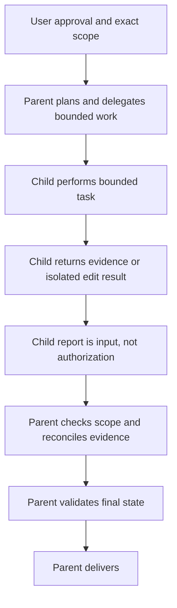

# Keep authority with the subagent parent

## TL;DR

Delegation can isolate context and specialize evidence collection, but it does
not transfer the parent agent's responsibility for approval, evidence
reconciliation, final validation judgment, or delivery. An approved worker may
run checks for its owned edit; the parent still reviews that evidence against
the final repository state. This repository makes that boundary explicit in its
subagent profiles and tool guidance. These local controls await an immutable
public source permalink.

Pi custom tools receive the working context and an abort signal during execution.
[S1] A parent can therefore bound a child call, but a child report remains input
to a parent decision rather than an authorization record.

## When To Read

- Use when splitting independent read-only searches or reads into child tasks.
- Use when an approved edit must be limited to named files.
- Do not treat a child completion message as proof that a change is correct or
  authorized.

## Knowledge

### Authority Flow



```text
user approval and exact scope
  -> parent plans and delegates bounded work
  -> child returns evidence or an isolated edit result
  -> parent checks scope, reconciles evidence, validates final state, delivers
```

The repository design separates read-only scout roles from an approval-gated
worker, caps parallel read-only tasks, and keeps worker execution single-mode.
Those are local controls; Pi's custom-tool API itself does not determine an
organization's approval policy. Pi does append active tools' `promptGuidelines`
to its system guidance. [S2]

### Capability And Boundary

Children can read large sources or perform a narrow task without forcing all raw
material into the parent's active context. The parent gains a bounded report and
can compare it with direct evidence. The parent does not gain certainty merely
because the child used a named profile.

A profile's tool list is an interface boundary, not an operating-system sandbox.
Pi documentation warns that extensions execute with full system permissions.
[S2] Treat process isolation, tool allowlists, file ownership checks, and human
approval as complementary controls.

### Failure Modes

- **Lost approval context:** a child cannot infer approval omitted from its task.
- **Conflicting reports:** parallel children can inspect different revisions or
  interpretations; the parent must reconcile them.
- **Unvalidated edit:** a worker can finish without proving behavior.
- **Nested delegation drift:** each layer can dilute scope unless the parent
  limits roles and output requirements.

### Minimal Example

```text
Parent: ask two read-only children for independent source maps.
Parent: compare their findings with the named files.
Parent: decide whether the approved one-file edit is still justified.
Parent: run the final check and report its result.
```

## Sources

| ID | Source | Accessed | Supports |
| --- | --- | --- | --- |
| S1 | [Pi extension types](https://github.com/earendil-works/pi/blob/38f18be44727e669eb0a6e2eb8edb51b0232d83c/packages/coding-agent/src/core/extensions/types.ts) | 2026-09-12 | Custom tool execution receives an abort signal and extension context. |
| S2 | [Pi extensions documentation](https://github.com/earendil-works/pi/blob/38f18be44727e669eb0a6e2eb8edb51b0232d83c/packages/coding-agent/docs/extensions.md) | 2026-09-12 | Active custom-tool prompt guidelines are added to system guidance and extensions run with full system permissions. |

## Related Notes

- [Prompt guidance is not enforcement](prompt-guidance-is-not-enforcement.md)
- [Intent routing and adapter verification](intent-routing-and-adapter-verification.md)
