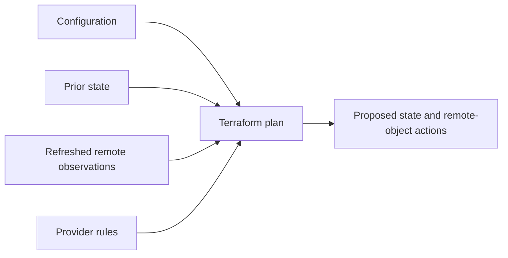

# Read Terraform plans as reconciliation proposals

## TL;DR

Terraform planning has three default steps: read existing remote objects, compare
current configuration with prior state, and propose actions that would make remote
objects match the configuration. [S1] The provider translates resource arguments
and observed remote attributes into create, update, destroy, or replacement
actions. [S3] State supplies the durable object binding; it is not the remote
system itself. [S2]

A plan therefore answers a bounded question for one configuration, state snapshot,
provider selection, and point in time. Re-run the final plan before apply when any
of those inputs might have changed. [S1]

## When To Read

- Use when a plan changes after no HCL edit.
- Use when import, drift, provider upgrades, or computed attributes produce an
  unexpected diff.
- Use when choosing between normal and refresh-only planning.
- Do not treat plan output as runtime health evidence.
- Do not publish saved plan files; they can contain sensitive values. [S1]

## Knowledge

### Reconciliation Model



Configuration expresses intent. State maps resource instances to remote objects
and caches attributes used during planning. Providers read those objects and
define which differences can update in place and which require replacement. [S1]
[S2]

Normal planning refreshes managed objects before comparing configuration and
state. A changed plan without a code change can therefore expose remote drift,
provider normalization, changed data-source results, or a different provider or
input selection. The diff alone does not identify which cause applies.

### Plan Modes And Time Boundaries

A speculative plan previews possible actions but carries no intent to apply them.
A saved plan can be passed to `terraform apply`, but its file contains the full
planned values and must be handled as sensitive data. [S1]

Refresh-only mode proposes updates to Terraform state and root outputs to match
changes already made remotely. It does not propose changing remote objects to
match configuration. Use it only when accepting the observed remote change is
the intended outcome. [S1]

A no-change plan establishes that Terraform found no action for the evaluated
root at that time. It does not prove that another state does not own the object,
that application behavior is healthy, or that a later apply will see identical
inputs.

### Review Sequence

1. Confirm the root, workspace, backend, variables, provider versions, and
   credentials used for the plan.
2. Separate refresh observations from configuration changes.
3. Classify each action as create, update, replace, destroy, import, move, or
   state-only change.
4. Inspect unknown values and dependency-driven changes instead of treating them
   as final values.
5. Re-run the non-speculative plan immediately before apply when concurrent or
   remote changes are possible. [S1]

### Boundaries

- State records bindings and attributes; it does not replace provider reads of
  the remote API. [S2]
- `-refresh=false` can hide remote changes and produce an incomplete proposal.
  It is an exceptional diagnostic or performance choice, not proof of safety.
  [S1]
- `-target` creates a partial plan for exceptional recovery cases. It does not
  validate the whole configuration. [S1]
- Provider behavior can change across versions. A plan reviewed with one provider
  lock selection does not automatically validate another selection.

### Common Mistakes

- **Calling every unexpected diff drift:** configuration, inputs, state, remote
  objects, or provider behavior may have changed.
- **Reading state as live truth:** cached state can lag the remote system until a
  refresh occurs.
- **Approving only by action count:** one replacement can have a larger effect
  than many in-place updates.
- **Reusing an old speculative plan:** intervening state or remote changes can
  alter the final result. [S1]
- **Using refresh-only to silence a diff:** it accepts observed remote values into
  state; it does not establish that those values match intended configuration.

### Minimal Example

```text
Plan says: replace one resource

Check in order:
1. Did an immutable provider argument change?
2. Did refresh observe remote drift?
3. Did provider or input selection change?
4. Is replacement ordering safe?
5. Does the final plan still show the same action immediately before apply?
```

## Sources

| ID | Source | Accessed | Supports |
| --- | --- | --- | --- |
| S1 | [HashiCorp terraform plan command reference](https://developer.hashicorp.com/terraform/cli/commands/plan) | 2026-09-13 | Default refresh and comparison steps, planning modes, speculative and saved plans, targeting, freshness, and sensitive plan files |
| S2 | [HashiCorp Terraform state purpose](https://developer.hashicorp.com/terraform/language/state/purpose) | 2026-09-13 | State as the mapping between configuration addresses and remote objects |
| S3 | [HashiCorp resource behavior](https://developer.hashicorp.com/terraform/language/resources/behavior) | 2026-09-13 | Create, update, destroy, and replacement behavior for managed resources |

## Related Notes

- [Preserve resource identity during Terraform ownership migrations](terraform-resource-ownership-migration.md)
- [Control Terraform replacement ordering explicitly](terraform-replacement-ordering-and-lifecycle.md)
