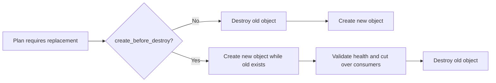

# Control Terraform replacement ordering explicitly

## TL;DR

A provider can require replacement when an argument cannot change in place.
Terraform normally destroys the existing object and then creates its replacement.
`create_before_destroy` reverses that order, but both objects must be allowed to
exist at once. [S1] [S2]

Lifecycle rules modify planning behavior. They do not make duplicate names valid,
preserve application availability by themselves, or prove that dependent systems
are ready for the new object.

## When To Read

- Use when a plan contains `-/+` or `+/-` replacement actions.
- Use when changing names, regions, immutable fields, backend attachments, or
  identity-bearing resources.
- Use when lifecycle rules appear to suppress or force changes.
- Do not add `ignore_changes` merely to make a plan empty.

## Knowledge

### Replacement Is A Two-Object Transition



The plan must answer four questions:

1. What provider or lifecycle rule caused replacement?
2. Can old and new objects coexist?
3. Which dependencies must switch before old-object deletion?
4. What validates that the new object serves its intended behavior?

Terraform's default replacement order is destroy then create. With
`create_before_destroy`, Terraform creates the replacement before destroying the
old object and propagates that behavior to dependencies where required. [S1]
The remote API can still reject coexistence because of unique names, quotas,
exclusive attachments, addresses, or singleton ownership.

### Lifecycle Controls

- `create_before_destroy` changes replacement order. It needs a coexistence plan
  and may require unique generated names. [S1]
- `prevent_destroy` rejects a plan that would destroy the configured resource,
  but removing the resource block also removes that protection from
  configuration. [S1]
- `ignore_changes` lets Terraform ignore selected configured attributes while
  planning updates after creation. This creates shared ownership with another
  process and should name that owner explicitly. [S1]
- `replace_triggered_by` replaces a resource when referenced managed resources or
  attributes change. It does not accept plain values because Terraform must track
  an address with planned actions. [S1]

### Dependency And Cutover Evidence

Terraform graph ordering covers declared configuration dependencies. External
consumers, DNS caches, database clients, load-balancer health, and asynchronous
control planes may not appear in that graph.

For an availability-sensitive replacement, separate these checkpoints:

```text
new object exists
new object is configured
new object is healthy
consumers use new object
old object receives no required traffic
old object can be deleted
```

`create_before_destroy` establishes only the create/delete order. Add explicit
configuration dependencies when Terraform owns the relationship, and use
behavior-level checks for relationships outside Terraform.

### Boundaries

- Replacement annotations come from the evaluated provider and configuration;
  the same argument may behave differently across resource types or provider
  versions.
- `prevent_destroy` is a guard against planned destruction, not a backup or
  recovery mechanism. [S1]
- `ignore_changes = all` stops Terraform from proposing updates after creation;
  it also weakens drift visibility for that resource. [S1]
- Lifecycle settings are evaluated early and accept only literal values. [S1]
- A reviewed speculative plan can become stale. Re-check the final plan before
  apply when state or remote objects may have changed. [S3]

### Common Mistakes

- **Turning on create-before-destroy without checking uniqueness:** creation can
  fail before cutover because the old name or attachment is still occupied.
- **Assuming graph order equals service readiness:** resource creation success can
  precede health checks, replication, or route propagation.
- **Using ignore_changes to hide conflict:** two control planes still own the
  field even when Terraform stops reporting the difference.
- **Treating prevent_destroy as permanent policy:** deleting its configuration can
  remove the guard. [S1]
- **Reviewing only the replaced resource:** dependents may also replace or retain
  references to the old object.

### Minimal Example

```hcl
resource "example_endpoint" "current" {
  name = "endpoint-${var.revision}"

  lifecycle {
    create_before_destroy = true
  }
}
```

The revision-derived name allows coexistence in this synthetic example. A safe
change still requires a health check, consumer cutover, and confirmation that the
old endpoint is no longer needed before deletion.

## Sources

| ID | Source | Accessed | Supports |
| --- | --- | --- | --- |
| S1 | [HashiCorp lifecycle meta-argument reference](https://developer.hashicorp.com/terraform/language/meta-arguments/lifecycle) | 2026-09-13 | Replacement ordering and the exact boundaries of create_before_destroy, prevent_destroy, ignore_changes, and replace_triggered_by |
| S2 | [HashiCorp resource behavior](https://developer.hashicorp.com/terraform/language/resources/behavior) | 2026-09-13 | Provider-driven create, update, destroy, and replacement actions |
| S3 | [HashiCorp terraform plan command reference](https://developer.hashicorp.com/terraform/cli/commands/plan) | 2026-09-13 | Plan review and final-plan freshness |

## Related Notes

- [Read Terraform plans as reconciliation proposals](terraform-plan-refresh-and-state-reconciliation.md)
- [Preserve resource identity during Terraform ownership migrations](terraform-resource-ownership-migration.md)
