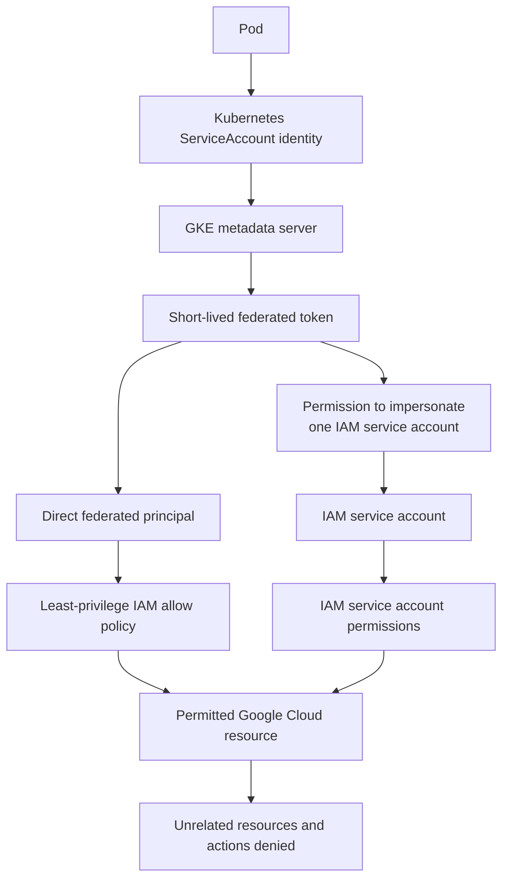

# Prefer workload identity over service account key files

## TL;DR

For workloads on GKE, Google recommends Workload Identity Federation for GKE in
most cases instead of less secure methods such as service account key files.
[S1] The GKE metadata server intercepts workload credential requests and
exchanges a Kubernetes identity token for a short-lived federated access token.
[S1]

Federation authenticates the workload; it does not authorize every API. Grant
the workload principal only the required IAM roles on the required resources.
Choose direct principal access by default, and use IAM service account
impersonation when compatibility or policy requires it. [S1] [S2]

## When To Read

- Use when a Pod needs a Google Cloud API token.
- Use when a Secret contains an exported service account JSON key.
- Use when mapping namespace and Kubernetes ServiceAccount identity to IAM.
- Use when deciding between direct federated-principal access and IAM service
  account impersonation.
- Do not assume enabling federation grants resource access.
- Do not delete a working key until the federated path and rollback boundary are
  verified.

## Knowledge

### Authentication And Authorization



```text
Pod
  → Kubernetes ServiceAccount identity
  → GKE metadata server
  → short-lived federated token
  → IAM allow policy
  → permitted Google Cloud resource
```

The metadata server handles credential delivery. IAM still decides whether the
resulting principal can call a target API. Google documents fine-grained workload
identities and requires an IAM allow policy for resource access. [S1] [S2]

Keep these questions separate:

1. Did the Pod obtain a token from the intended identity path?
2. Which principal does the token represent?
3. Which resource-level roles authorize that principal?
4. Can the workload access only its intended resources and actions?

A successful token request answers only the first question.

### Direct Principal Access

Workload Identity Federation for GKE can bind IAM permissions directly to a
principal that represents a Kubernetes namespace, ServiceAccount, or workload.
Google describes principal identifiers as the preferred access method where the
target API supports federated identities. [S1] [S2]

This model avoids creating a separate IAM service account merely as an identity
bridge. Scope the policy to the narrowest resource that supports the required
role.

### IAM Service Account Impersonation

Some APIs or operational contracts require an IAM service account identity. GKE
also supports mapping a Kubernetes ServiceAccount to impersonate an IAM service
account. The workload first obtains a federated token and then exchanges it
through the IAM Service Account Credentials API. [S1] [S2]

Impersonation adds another policy edge:

```text
Kubernetes principal
  → permission to impersonate one IAM service account
  → IAM service account permissions on target resources
```

Review both edges. A narrow impersonation binding does not compensate for broad
roles on the IAM service account.

### Why Key Files Are Different

A service account key is exported private-key material. Google recommends
avoiding service account keys whenever possible, notes that keys do not expire by
default, and warns that anyone who possesses a key can use it. [S3] [S4]

Key files create distribution and lifecycle problems:

- the credential can be copied outside the workload;
- rotation requires replacing every distributed copy;
- deleting a Kubernetes Secret does not revoke copies elsewhere;
- long-lived keys weaken attribution between one Pod identity and one API call;
- secret volume access can widen credential access inside a workload.

Workload identity removes the downloaded key-file requirement for the supported
path. It does not remove token theft risk, IAM misconfiguration, or the need to
protect the Pod and node.

### GKE Configuration Boundaries

Autopilot clusters always enable Workload Identity Federation for GKE. Standard
clusters require cluster-level enablement and metadata-server-enabled node pools;
enabling the cluster setting does not retrofit every existing node pool. [S2]

On Standard clusters, workload placement must reach nodes using the GKE metadata
server. Autopilot already uses that path and rejects the Standard-specific node
selector. [S2]

Check the deployed GKE version and feature-specific limits. Do not invent one
general minimum version when the official page documents separate requirements
for individual features.

### Migration From A Key

1. Inventory the workload's actual API calls and target resources.
2. Choose one Kubernetes ServiceAccount for the workload boundary.
3. Enable the metadata-server path for the target cluster/node pool.
4. Grant either direct principal access or reviewed impersonation.
5. Test token acquisition and each required API operation.
6. Prove access to unrelated resources and actions is denied.
7. Remove key references from workload desired state.
8. Revoke or delete the old key through an authorized human process after all
   consumers are known.
9. Verify that no copied key remains in CI variables, external secret stores,
   images, files, or backups under the applicable retention process.

Changing the Pod to stop mounting a key is not credential revocation. Revocation
must occur at the IAM key lifecycle boundary.

### Validation

- Confirm the Pod uses the intended namespace and Kubernetes ServiceAccount.
- Confirm the node path exposes the GKE metadata server as intended.
- Resolve the effective federated principal or impersonated service account.
- Inspect resource-level IAM bindings and inherited grants.
- Test allowed API calls from the workload identity path.
- Test denied actions and unrelated resources.
- Confirm no service account key file or key-bearing Secret is mounted.
- Review audit logs for the expected principal, target, and denied probes.
- Recheck after rollout because an old ReplicaSet can retain the previous
  credential path until its Pods terminate.

### Boundaries

- Workload identity provides credentials; IAM policies provide authorization.
  [S1] [S2]
- Direct principal access and service account impersonation are different models.
- A short-lived token can still be abused during its lifetime.
- Node compromise, container escape, excessive Pod access, or broad IAM roles are
  not solved by changing credential delivery alone.
- Key removal from Git or Kubernetes does not revoke a real key; revoke it at the
  IAM service account boundary.
- Some APIs have federated-identity limitations. Use impersonation only after
  checking the current official compatibility guidance. [S2]

### Common Mistakes

- **Enabling federation without an IAM allow policy:** authentication succeeds but
  the target API remains unauthorized.
- **Granting project-wide roles for convenience:** the workload receives access
  beyond the resource it needs.
- **Using both direct access and impersonation without need:** two authorization
  paths become harder to audit.
- **Deleting only the Kubernetes Secret:** copied service account keys remain
  valid until revoked or deleted.
- **Assuming every Standard node pool is enabled:** existing pools can retain the
  old metadata behavior. [S2]
- **Testing only token acquisition:** a token does not prove least privilege or
  application compatibility.

### Minimal Decision Model

```text
GKE workload needs a supported Google Cloud API?
  → Prefer direct federated-principal access.

Target requires IAM service account identity?
  → Use reviewed service account impersonation.

Workload currently mounts a key file?
  → Establish and validate the federated path first.
  → Remove the mount, then revoke the old key through an authorized process.

Access works?
  → Also prove unrelated access is denied.
```

## Sources

| ID | Source | Accessed | Supports |
| --- | --- | --- | --- |
| S1 | [Google Cloud Workload Identity Federation for GKE concepts](https://cloud.google.com/kubernetes-engine/docs/concepts/workload-identity) | 2026-09-11 | Recommendation, metadata-server token flow, direct principals, and fine-grained authorization |
| S2 | [Google Cloud authenticate GKE workloads](https://cloud.google.com/kubernetes-engine/docs/how-to/workload-identity) | 2026-09-11 | IAM configuration, impersonation, and Autopilot/Standard setup boundaries |
| S3 | [Google Cloud service account security best practices](https://cloud.google.com/iam/docs/best-practices-service-accounts) | 2026-09-11 | Service account key avoidance and least-privilege guidance |
| S4 | [Google Cloud create and delete service account keys](https://cloud.google.com/iam/docs/keys-create-delete) | 2026-09-11 | Default key lifetime risk and key-creation controls |

## Related Notes

- None.
