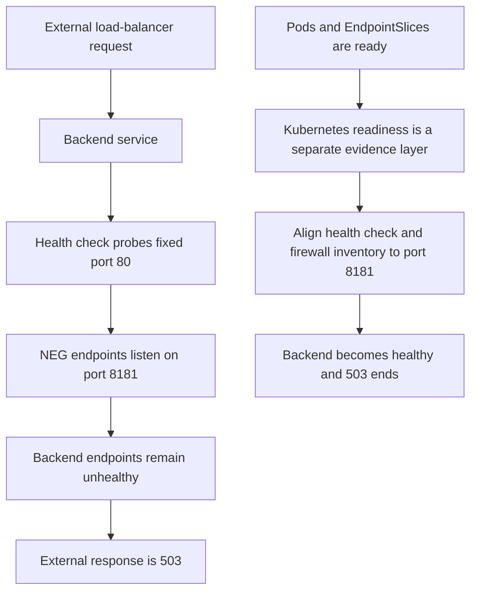

# Kubernetes readiness does not prove standalone NEG backend health

Synthetic educational case — not a sanitized incident record.

## TL;DR

A synthetic GKE service had ready Pods and programmed standalone NEG endpoints,
but its external Application Load Balancer returned `503`. The backend service
reported every endpoint unhealthy. Its HTTP health check probed fixed port `80`,
while each NEG endpoint listened on port `8181`.

Changing the health check to the endpoint port and allowing that port from the
health check probers made the backend healthy and removed the load-balancer
`503`. Kubernetes readiness and load-balancer backend health were separate
evidence layers in this case. Google documents that standalone NEGs do not
assume a Compute Engine health check and that each endpoint contains a Pod IP and
target port. [S1]

## When To Read

- Use when DNS and TLS succeed but an external Application Load Balancer returns
  `503`.
- Use when Pods, Services, EndpointSlices, or NEG readiness gates look healthy
  while the backend service does not.
- Do not use readiness alone to claim that a Google Cloud backend is healthy.

## Knowledge

For a standalone zonal NEG, GKE manages NEG membership while the load balancer,
backend service, health check, and related firewall rules are managed separately.
Each NEG endpoint is a Pod IP and target port. [S1]

A backend service health check can use a fixed numbered port or the serving port
of each NEG endpoint. An HTTP health check defaults to port `80` when its port
selection is omitted. [S2] A fixed port is valid only when the application
listens there and the health check path and protocol also match.

Google Cloud health check probers must be allowed to reach the backend. A correct
application listener still appears unhealthy when ingress firewall policy blocks
the probe. [S3]

Diagnose the path as separate layers:

```text
hostname -> URL map -> backend service -> health check
         -> zonal NEG -> endpoint IP:port -> application health path
```

Verify backend service health before interpreting an external `503`. Google also
recommends checking the health check port, path, and protocol before
troubleshooting other 5XX causes. [S4]

## Synthetic Source Packet

### Topology

```text
api.dev.example.test
  -> external Application Load Balancer
  -> example-api-backend
  -> three zonal standalone NEGs
  -> three ready Pods on port 8181
```

All names, quantities, addresses, ports, timings, and outputs below are fictional.

### Desired And Live Evidence At T+0

```text
Deployment desired=3 ready=3 available=3
EndpointSlice endpoints=3 ready=3
Pod Ready=True neg-readiness-gate=True restartCount=0
NEG endpoints=192.0.2.21:8181,192.0.2.22:8181,192.0.2.23:8181
```

The backend service uses:

```hcl
health_check {
  protocol = "HTTP"
  port     = 80
  path     = "/health/ready"
}
```

The application health endpoint succeeds inside the service path:

```text
GET http://192.0.2.21:8181/health/ready -> 200
```

The load-balancer evidence disagrees:

```text
backend endpoint 192.0.2.21:8181 UNHEALTHY
backend endpoint 192.0.2.22:8181 UNHEALTHY
backend endpoint 192.0.2.23:8181 UNHEALTHY
GET https://api.dev.example.test/ -> 503
```

### Applied Synthetic Fix

The owner changed the fixed health check port from `80` to `8181` and updated the
health-check firewall port inventory. The URL map, NEG names, Pod selectors, and
application artifact did not change.

## Investigation



| Hypothesis | Evidence | Falsifier | Result |
| --- | --- | --- | --- |
| The public frontend is unreachable | DNS and TLS complete | Connection or certificate failure | Rejected |
| Pods are unavailable | All Pods and EndpointSlice entries are ready | Unready or absent endpoints | Rejected |
| NEG membership is missing | Every Pod IP and target port appears in the NEG | Missing endpoint membership | Rejected |
| The backend health check targets the wrong port | Fixed port `80` differs from endpoint port `8181`; direct health request on `8181` succeeds | A successful probe on configured port `80` | Confirmed |
| Firewall policy alone causes the failure | Port `80` is allowed but no process listens there | A listener on `80` blocked by firewall evidence | Rejected as the initial cause |

## Wrong Turns

- **Treating Pod readiness as load-balancer health.** The two control planes use
  different checks in this topology.
- **Renaming the NEG.** Membership and endpoint ports were already correct;
  changing its name would not fix the probe destination.
- **Testing only the public root path.** A `503` identified an unhealthy backend,
  but the backend health API and exact health-check configuration located the
  failing edge.
- **Changing only the firewall.** Allowing a port with no listener does not make
  the health check succeed.

## Root Cause And Contributing Factors

- **Root cause:** the backend service had no healthy endpoints because its health
  check probed fixed port `80` instead of endpoint port `8181`.
- **Contributing factor:** deployment validation stopped at Kubernetes readiness
  and did not compare health check and NEG endpoint ports.
- **Not causal:** Pod readiness, NEG membership, DNS, TLS, and the application
  artifact were healthy or unchanged in the synthetic packet.

## Resolution

- **Applied change:** changed the fixed health check port from `80` to `8181` and
  added `8181` to the health-check firewall port inventory.

The serving-port mode is also valid when it matches the endpoint contract. Keep
the health check protocol and path aligned with the application, and permit
health check probers through the firewall. [S2][S3]

## Validation

- **Behavior checked:** backend endpoint health, the public readiness path, the
  public root response, and a fresh infrastructure plan.
- **Result:** at T+6m, all three backend endpoints reported healthy, the public
  readiness path returned `200`, the public root returned the application's
  expected `404` instead of a load-balancer `503`, and the fresh plan reported no
  changes.

This validates the represented fix. It does not prove that every future `503`
with ready Pods has the same cause.

## Sources

| ID | Source | Accessed | Supports |
| --- | --- | --- | --- |
| S1 | [Google Kubernetes Engine: Use standalone NEGs](https://cloud.google.com/kubernetes-engine/docs/how-to/standalone-neg) | 2026-09-11 | Standalone NEG ownership boundaries, Pod IP and target port endpoints, readiness behavior, and backend health verification |
| S2 | [Google Cloud Load Balancing: Use health checks](https://cloud.google.com/load-balancing/docs/health-checks) | 2026-09-11 | Fixed health check ports, serving-port mode, and the HTTP port default |
| S3 | [Google Cloud Load Balancing: Health check concepts](https://cloud.google.com/load-balancing/docs/health-check-concepts) | 2026-09-11 | Required ingress firewall access from health check probers |
| S4 | [Google Cloud Load Balancing: Troubleshoot external Application Load Balancers](https://cloud.google.com/load-balancing/docs/https/troubleshooting-ext-https-lbs) | 2026-09-11 | Verify backend health and health check port, path, and protocol before other 5XX diagnosis |

## Related Notes

- [A liveness restart does not establish the startup root cause](synthetic-startup-restart-causality.md)
