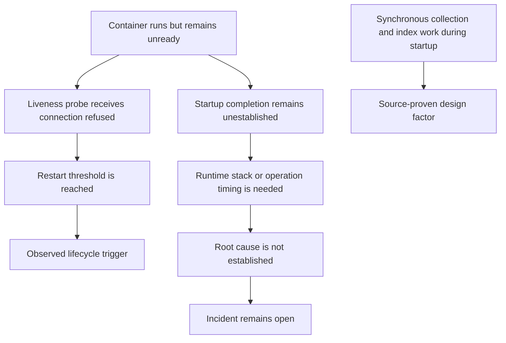

# A liveness restart does not establish the startup root cause

Synthetic educational case — not a sanitized incident record.

## TL;DR

A synthetic rollout showed multiple Java containers restarting after liveness
probes could not connect to their health ports. Kubernetes events established the
restart mechanism. They did not establish why startup never completed. [S1]

Source inspection proved that each service synchronously performed repeated
MongoDB collection and index checks during application-context creation. Runtime
logs narrowed the candidate region, but no thread stack or operation timing
identified the blocking call. The incident therefore remains `open`: the source
design risk is proven; its role as the incident root cause is not.

## When To Read

- Use when `Running` containers remain unready and later restart after health
  checks receive `connection refused`.
- Use when many services share startup dependency code and the investigation is
  tempted to infer overload from operation counts.
- Do not use this note as proof that MongoDB, probes, memory, or a new image caused
  a current incident.

## Knowledge

Kubernetes liveness, readiness, and startup probes answer different questions.
A failed liveness probe can restart a container; a startup probe can delay
liveness/readiness until startup succeeds. Probe behavior explains lifecycle
actions, not the application’s internal blocking call. [S1]

Spring Boot can expose liveness and readiness health groups for Kubernetes. The
application context and health endpoint availability must be interpreted from
runtime evidence rather than from “Tomcat initialized” or another intermediate
startup message alone. [S2] A useful incident record also keeps the trigger,
root cause, recovery, and measurable follow-up distinct. [S4]

MongoDB index creation is a real database operation with resource and application
performance considerations. [S3] Source code that performs such work
synchronously on every service startup is a source-proven design risk. Calling it
this incident’s root cause still requires aligned runtime timing, a stack, trace,
or database-side operation evidence.

## Synthetic Source Packet

### Topology And Assumptions

```text
Deployment controller
├── example-api-a (old and new ReplicaSets)
├── example-api-b (old and new ReplicaSets)
├── example-worker
└── example-gateway
        └── shared document database
```

All names, quantities, timings, outputs, and code below are fictional. The packet
preserves an evidence-classification problem, not a private system identity.

### Relative Timeline

| Relative time | Layer | Synthetic evidence |
| --- | --- | --- |
| T-18m | Kubernetes | An old-artifact replacement Pod starts failing liveness before the new rollout. |
| T+0 | CI | A new rollout begins after all package jobs succeed. |
| T+3m | Pod | New containers are `Running` but readiness has not begun. |
| T+4m | Application | Database monitor connections and cache bean creation report success. |
| T+5m | Application | The last progress log is a mapping warning also present in a healthy baseline. |
| T+8m | Kubernetes | Liveness receives connection refused and restarts the container. |
| T+9m | Application | Restarted containers repeat the same visible sequence. |

The earlier old-artifact failure falsifies “the new rollout initiated the
incident.” The rollout may still be a contributing factor, but that requires
measurement.

### Desired And Live Probe Fragment

```yaml
startupProbe: null
readinessProbe:
  httpGet: {path: /health/ready, port: 8080}
  initialDelaySeconds: 420
livenessProbe:
  httpGet: {path: /health/live, port: 8080}
  initialDelaySeconds: 420
  periodSeconds: 12
  failureThreshold: 4
```

Desired and live fields match in this synthetic packet.

### Pod State And Events

```text
phase=Running ready=false restartCount=1
lastState=terminated reason=Error exitCode=137
Warning Unhealthy  Liveness probe failed: connect: connection refused
Normal  Killing    Container failed liveness probe and will be restarted
```

No synthetic state reports `OOMKilled`. Exit code 137 alone is not OOM evidence.

### Application Progress Logs

```text
T+04:02 database monitor connected to primary
T+04:08 cache manager bean initialized
T+05:01 mapping metadata warning for ExampleRecord.id
T+07:52 shutdown hook started
```

A healthy baseline contains the same warning, then reaches `Application started`
within several seconds. The final log is the last emitted message, not a thread
stack.

### Source And Artifact Comparison

Synthetic source at both artifact revisions contains:

```java
void initializeSchema() {
    for (Class<?> model : fortySharedModels) {
        if (!database.collectionExists(model)) {
            database.createCollection(model);
        }
    }
    for (Entity entity : mappingContext.entities()) {
        ensureDeclaredIndexes(entity);
    }
}
```

The revision diff changes only `docs/guide.md`. That rejects a source-diff
regression in this method; it does not prove resolved dependencies, image bytes,
or runtime configuration are identical.

## Investigation

### Hypotheses And Tests

| Hypothesis | Supporting evidence | Falsifier or gap | Grade |
| --- | --- | --- | --- |
| Liveness caused each observed restart | Probe failure and termination events align with container state | Does not explain incomplete startup | observed mechanism |
| Shared schema initialization is a risky startup design | Exact delivered source runs synchronous collection/index work | Runtime has no stack or per-call timing | source-proven design factor |
| The new rollout initiated the incident | New Pods reproduce the symptom | Old-artifact failure starts earlier | falsified as initial trigger |
| Concurrent schema checks overloaded the database | Several Pods could execute the same method | Counts are estimates; no latency, queue, lock, or operation evidence | inconclusive |
| Exit code 137 proves OOM | Container was killed | No `OOMKilled` or aligned memory evidence | unsupported |

## Wrong Turns

- **“The final warning is the blocking call.”** A log marks emission, not the
  current Java stack. The healthy baseline emits the same warning.
- **“Database connected, so database work is healthy.”** Monitor connection
  success does not verify later collection or index operations.
- **“Forty checks times several Pods proves overload.”** A static count does not
  measure concurrent commands, round trips, saturation, queueing, or lock wait.
- **“The latest revision caused it.”** A documentation-only source diff and an
  earlier old-artifact failure weaken that claim, while artifact/config equality
  remains unverified.
- **“Increase the liveness delay.”** A larger delay may prevent premature restart
  or merely postpone a permanent block; current evidence cannot choose.

## Root Cause And Contributing Factors



- **Immediate lifecycle trigger:** liveness connection failures reached the
  restart threshold.
- **Root cause:** not established.
- **Source-proven design factor:** synchronous shared collection/index work is
  coupled to every service’s startup.
- **Possible contributing factors:** concurrent startup, database operation
  latency, another bean initializer, or artifact/config differences. None is
  confirmed by this packet.

## Resolution

- **Status:** not verified.
- **Next decisive check:** capture the Java main-thread stack while the container
  is unready. If unavailable, instrument initializer entry/exit and each bounded
  database operation in a controlled single-Pod reproduction.
- **Conditional fix surfaces:** move schema work to one idempotent owner only if
  runtime evidence confirms that path; add a startup probe only if startup makes
  bounded progress and probe timing is the demonstrated recovery problem.

This note must remain `open` until a represented fix is applied and validated.

## Validation

A future verified revision of this case must show:

1. the blocking call from a stack, span, or operation timing;
2. the same-artifact/config single-Pod baseline;
3. the applied fix changes the measured behavior rather than only delaying kill;
4. restart and readiness behavior under a controlled concurrent rollout;
5. remaining artifact, configuration, and dependency evidence gaps.

## Sources

| ID | Source | Accessed | Supports |
| --- | --- | --- | --- |
| S1 | [Kubernetes documentation: Liveness, Readiness, and Startup Probes](https://kubernetes.io/docs/concepts/configuration/liveness-readiness-startup-probes/) | 2026-09-11 | Probe responsibilities and container restart behavior |
| S2 | [Spring Boot reference: Kubernetes Probes](https://docs.spring.io/spring-boot/reference/actuator/endpoints.html#actuator.endpoints.kubernetes-probes) | 2026-09-11 | Spring Boot liveness/readiness health groups and application lifecycle considerations |
| S3 | [MongoDB manual: Create an Index](https://www.mongodb.com/docs/manual/core/indexes/create-index/) | 2026-09-11 | Index creation behavior and operational considerations |
| S4 | [Google SRE Workbook: Postmortem Culture](https://sre.google/workbook/postmortem-culture/) | 2026-09-11 | Separate impact, trigger, root cause, resolution, and follow-up evidence |

## Related Notes

- [Bounded Markdown knowledge retrieval for coding agents](../fundamentals/bounded-markdown-knowledge-retrieval.md)
