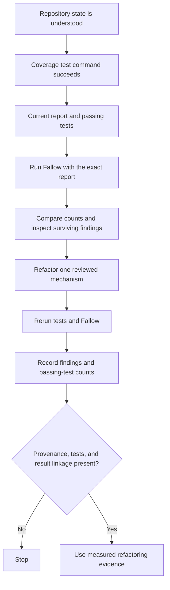

# Coverage-backed Fallow refactoring

## TL;DR

Fallow can consume Istanbul-format coverage to calculate measured per-function
CRAP scores; without it, health uses a static estimated coverage model. [S1]
Generate the repository's coverage report, run health against that exact file,
inspect the surviving findings, then make the smallest behavior-preserving
refactor and rerun both commands.

In the recorded repository-public case, the sequence was **54 estimated
findings -> 17 coverage-backed findings -> 0 after refactoring**, with **59
tests passing**. These are local observations pending a public immutable source
permalink; they are not a general Fallow benchmark.

## When To Read

- Use when estimated Fallow health output is too broad to justify a refactor.
- Use when `coverage/coverage-final.json` was generated by the current test run.
- Stop when coverage provenance, test success, or a finding's behavioral scope
  cannot be established from public-safe evidence.

## Knowledge

### Prerequisites

- Work from a cleanly understood repository state.
- Ensure the coverage-producing test command completes successfully.
- Treat `coverage/coverage-final.json` as an Istanbul coverage artifact, not as
  proof that every runtime path is exercised. The Istanbul JSON reporter writes
  a coverage object keyed by file path. [S3]
- Keep the refactor within approved file ownership.

### Steps



1. Generate the report and confirm tests pass:

   ```text
   npm run test:extensions:coverage
   ```

2. Run Fallow with the generated report:

   ```text
   npx fallow health --coverage coverage/coverage-final.json
   ```

3. Compare estimated and coverage-backed finding counts, then inspect each
   surviving function and its tests. Fallow's coverage input replaces estimated
   coverage with Istanbul data for per-function CRAP scoring. [S1]

4. Refactor one reviewed mechanism at a time. Preserve public tool contracts,
   error handling, output completeness, and test intent; do not delete code just
   because a finding disappears.

5. Repeat both commands. Record the remaining finding count and passing-test
   count. Stop if a test fails, the coverage file is stale or absent, or a result
   cannot be tied to the changed code.

### Interpretation Boundaries

Fallow's default estimated model assigns coverage based on test reachability;
it can produce false positives and false negatives. [S2] Coverage-backed CRAP
prioritizes complexity and measured coverage, not semantic equivalence,
security, API compatibility, or deployment safety.

c8 uses Node.js built-in coverage and is compatible with Istanbul reporters.
[S4] That supports this repository's report-production path, but it does not
prove that a particular report contains all intended suites. Use the test result
and report location together.

### Common Mistakes

- **Comparing counts from different revisions:** the delta has no refactoring
  meaning.
- **Treating zero findings as zero risk:** Fallow is a prioritization signal.
- **Using stale coverage:** measured scores then describe an earlier test run.
- **Refactoring before inspecting survivors:** lower count does not identify a
  safe change boundary.

## Sources

| ID | Source | Accessed | Supports |
| --- | --- | --- | --- |
| S1 | [Fallow health CLI reference](https://docs.fallow.tools/cli/health) | 2026-09-12 | `--coverage` accepts Istanbul-format data such as `coverage-final.json`, calculates per-function CRAP, and differs from the estimated model. |
| S2 | [Fallow health explanation](https://docs.fallow.tools/explanations/health) | 2026-09-12 | Estimated and Istanbul coverage models, their false-positive/false-negative boundary, and CRAP interpretation. |
| S3 | [Istanbul JSON reporter](https://github.com/istanbuljs/istanbuljs/blob/28ffdbc314596bdcb3007e85d30a62372602b262/packages/istanbul-reports/lib/json/index.js) | 2026-09-12 | The reporter writes a JSON object keyed by covered file path, defaulting to `coverage-final.json`. |
| S4 | [c8 README](https://github.com/bcoe/c8/blob/ae5a0cf4349b92cac910cf7275e724ab7a725b9d/README.md) | 2026-09-12 | c8 uses Node.js built-in coverage and is compatible with Istanbul reporters. |

## Related Notes

- [Evidence layers and causal restraint](../fundamentals/evidence-layers-and-causal-restraint.md)
